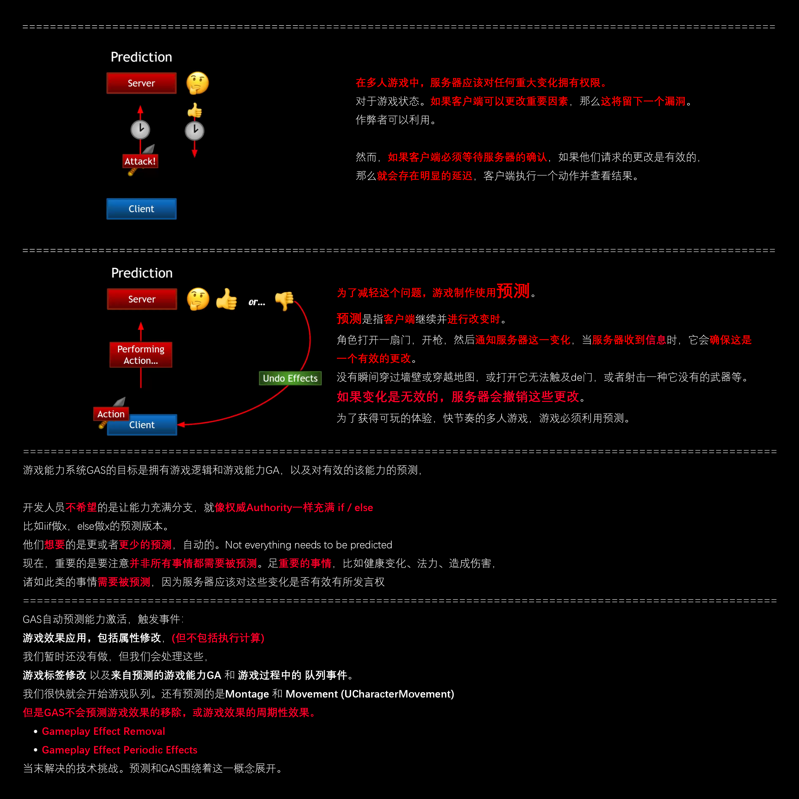
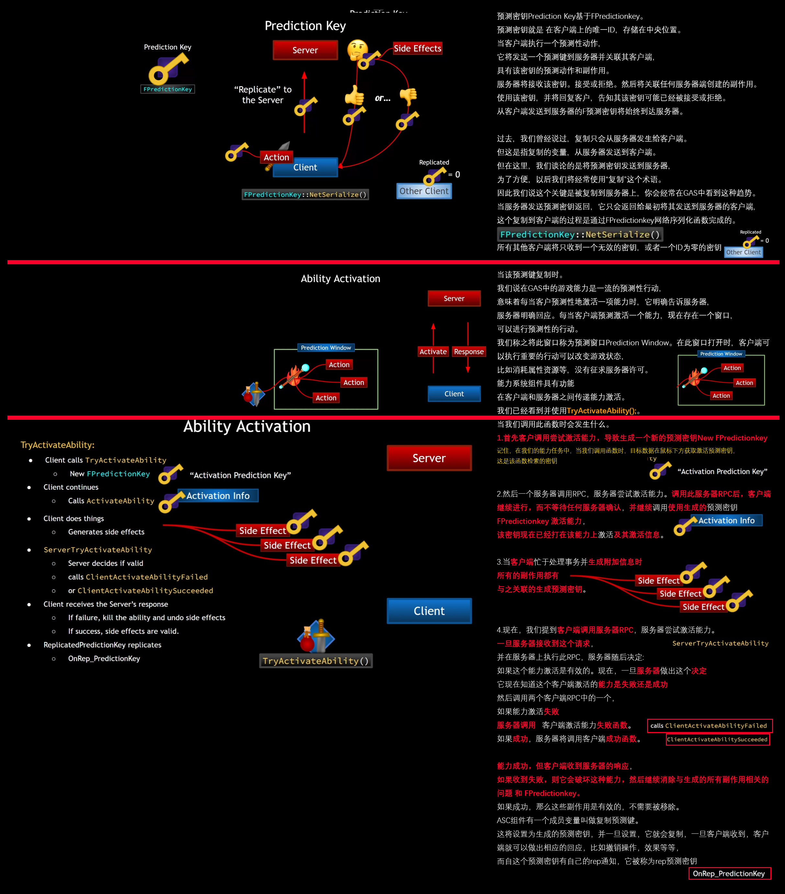
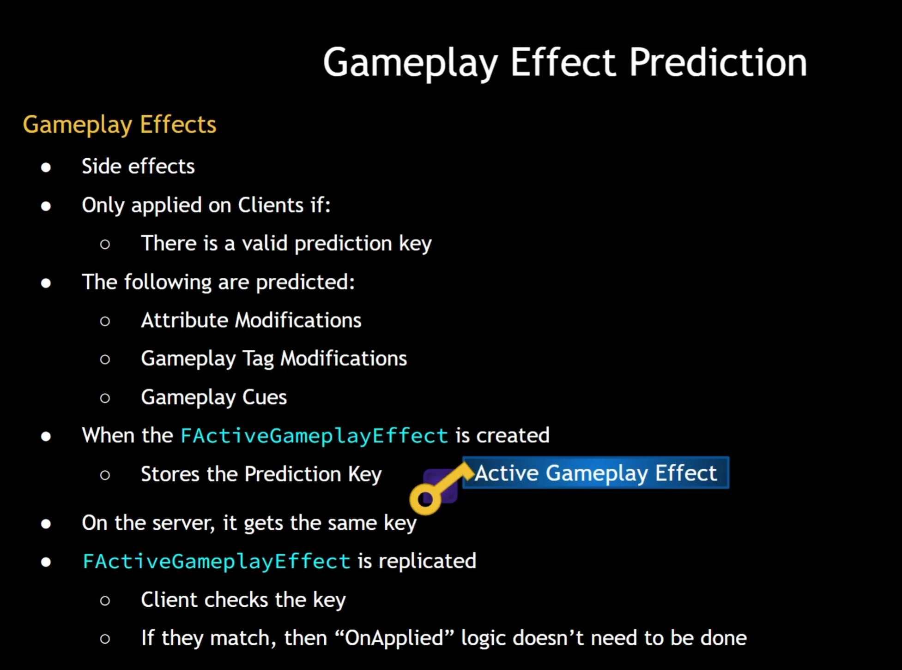
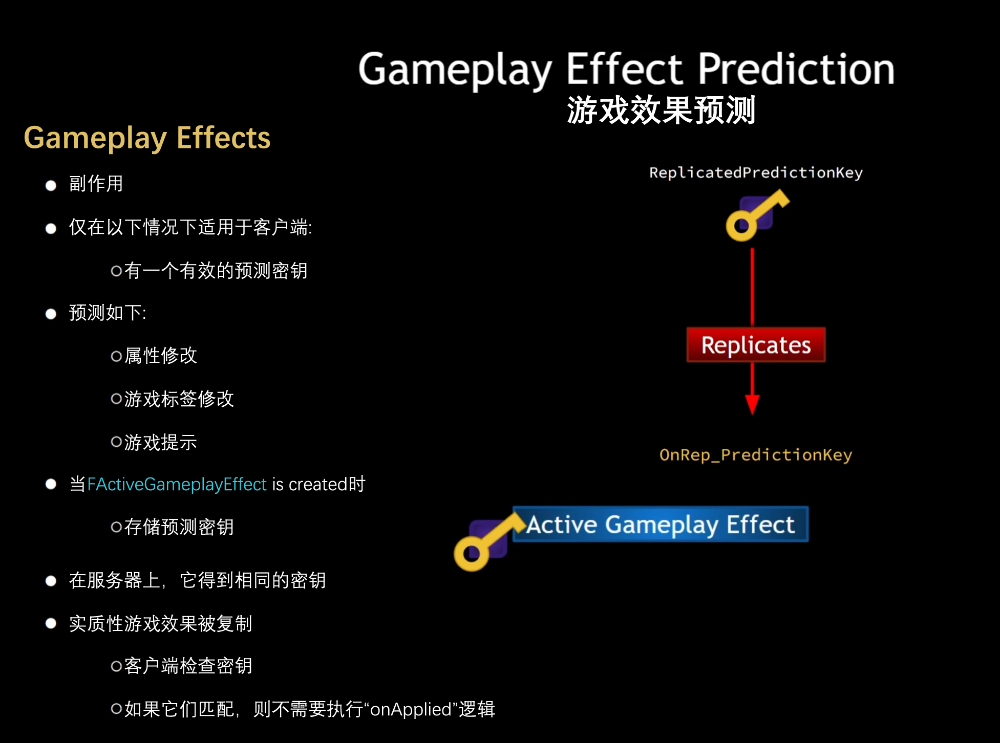
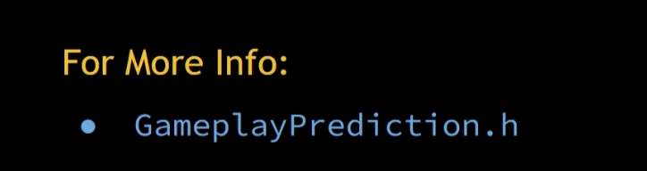

# 000 预测和预测密钥Predictionkey梳理
- 视频链接
    - 【【AI中字】虚幻5C++教程使用GAS制作RPG游戏（一）-哔哩哔哩】 [https://b23.tv/PiOquQy]("https://b23.tv/PiOquQy")
-  [https://zhuanlan.zhihu.com/p/458192589?utm_psn=1801233950850568192]("https://zhuanlan.zhihu.com/p/458192589?utm_psn=1801233950850568192")
-  
-  
-  
    -  
- GameplayPrediction.h **其中的评论解释了视频中我们讨论的许多内容，了解更多有关预测如何处理的信息，包括游戏玩法的预测属性，以及在面对更高级别挑战时所面临的一些实施预测系统和GAS。** 