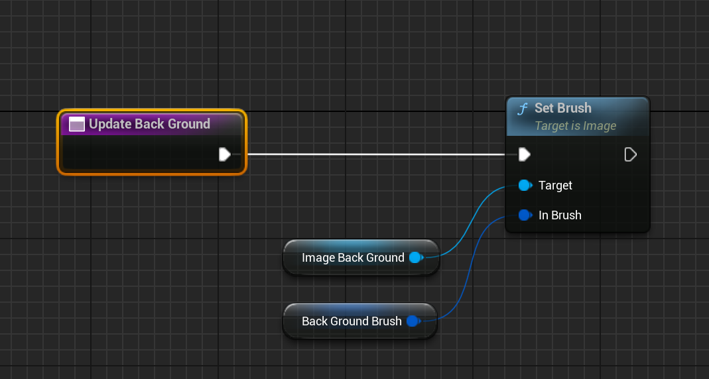
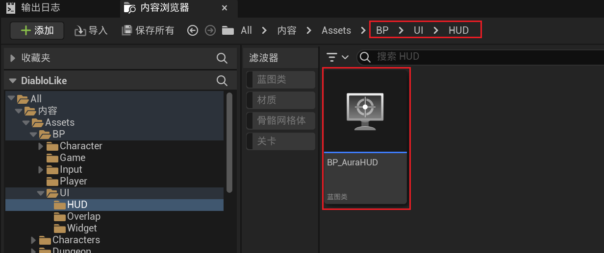

# GAS 2.6 创建UI
- 玩家HP UI基类 继承自UserWidget( **这部分架构在2.7 MVC中解释** )
    - 创建继承自UserWidget类的C++类
        -  
    - 创建子蓝图类
        -  
        -  
        -  
        -  
        -  
        -  
        -  
    - 创建各种调节参数的函数
        -  
        - UpdateBoxSize
            -  
        - UpdateBackGround
            -  
        - UpdateGlobePadding
            -  
        - SetGlobeImage
            -  
        - UpdateGlassPadding
            -  
        - UpdateGlassImage
            -  
        - 默认值 
- 添加显示血量和魔法的UI
    - 创建子类，继承自上面创建的UMG
        -  
        -  
    - 配置子类
        - 子类显示基类的变量
            -  
- 创建显示玩家信息的UMG
    -  
    -  
- 创建HUD
    - 头文件
        -  
    - 源文件
        -  
- 创建蓝图类继承自，自建的HUD
    -  
    -  
    - 因为断言的存在，这里不配置会崩溃 
- UI创建完成 