# GAS 2.7 项目MVC架构
- **关键点：结构下面是结构梳理：MVC(Model->四大数据PC/PS/ASC/AS；View->AuraUserWidget；Control->WidgetController)+使用发布更新的架构1角色（这里是角色，也可以是别的）初始化时调用HUD，根据配置的class在堆区实例化OverlayWidgetController，传入数据更新OverlayWidgetController中的数据（只在初始化时，创建包含四大数据的结构体，才给OverlayWidgetController传入指针数据，后续自行持有指针）**
- 架构 概述
    - **每个UI的集合是Widget，不可能直接从模型Model中获取数据，所以使用一个WidgetController作为中间的数据载体，使用发布更新的架构，不用知道谁接收了数据。而WidgetController的职责就是从Model中获取数据并更新自身数据**
- 创建WidgetController继承自UObject，并创建保存四大数据的结构体FWidgetControllerParams
    -  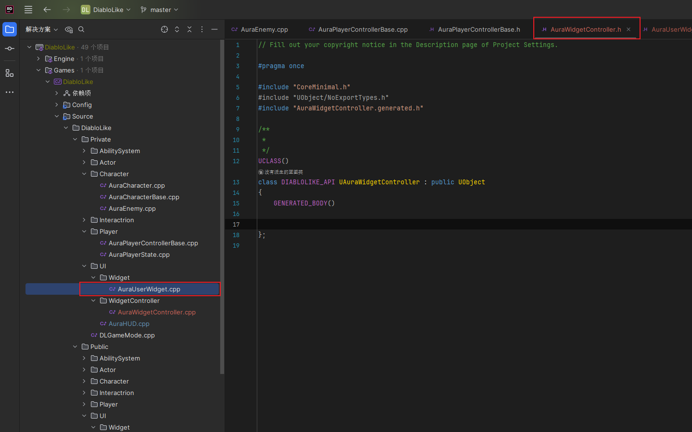
    -  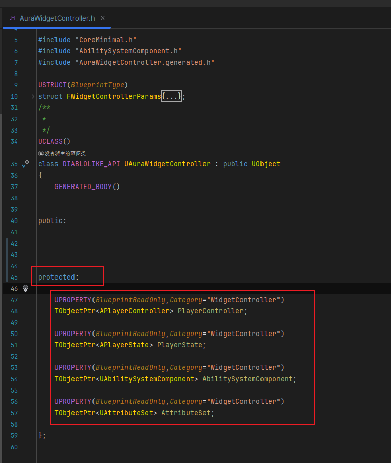
    - 保存四大数据：PC/PS/ASC/AS
    -  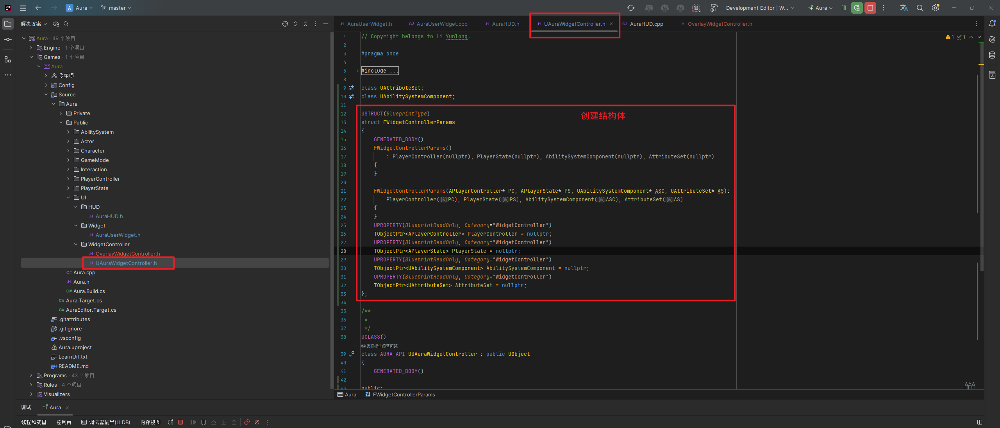
    -  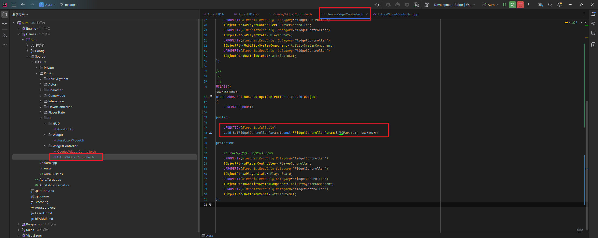
        -  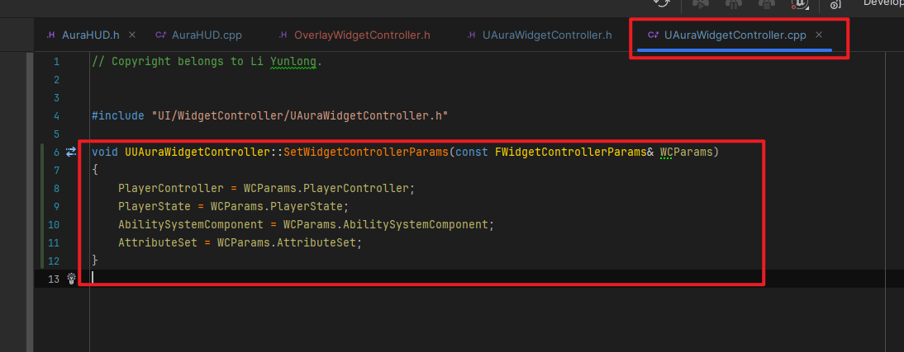
- **Overlay控制器** : 创建OverlayWidgetController继承自AuraWidgetController
    -  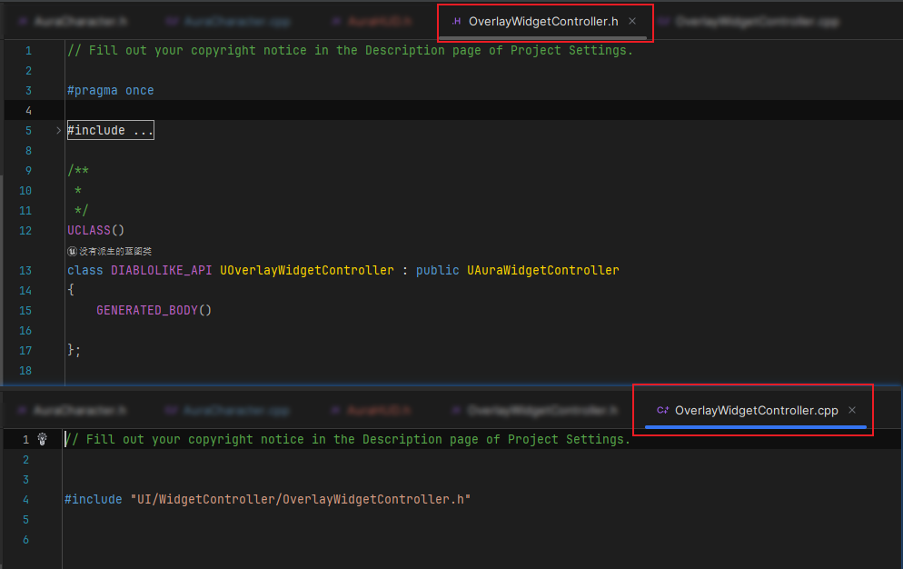
    -  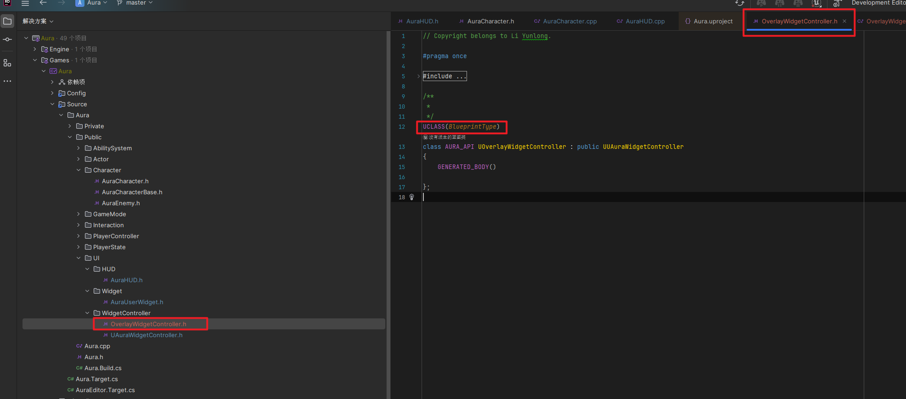
- UserWidget中
    -  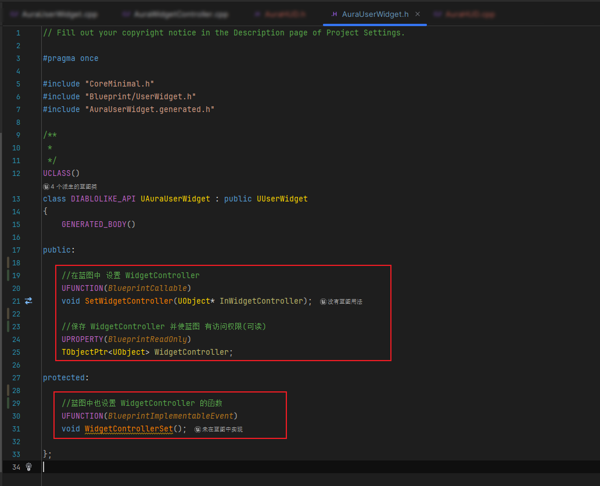
    -  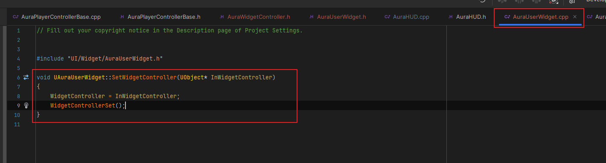
    - **设置并保存WidgetController**
    - **此时的逻辑结构**
        -  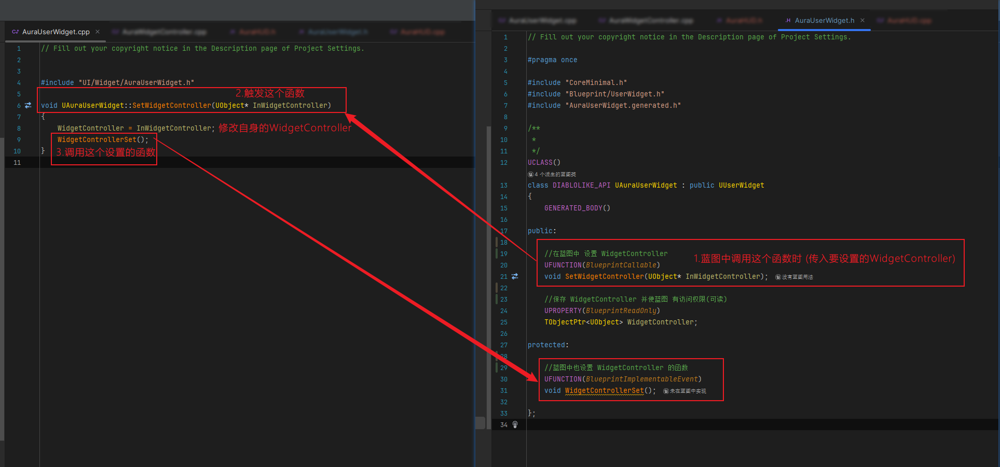
        -  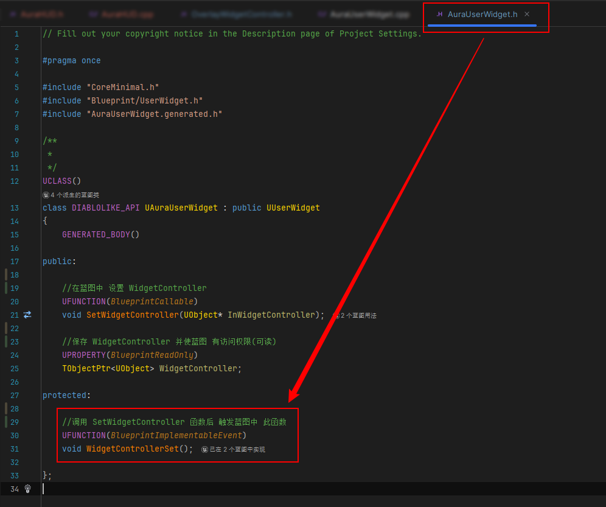
- HUD的作用 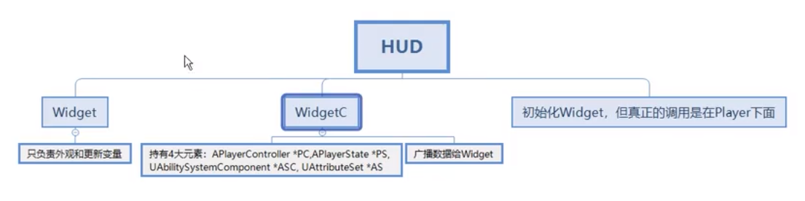
- HUD中
    -  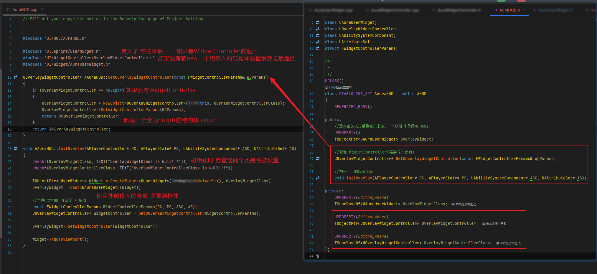
    -  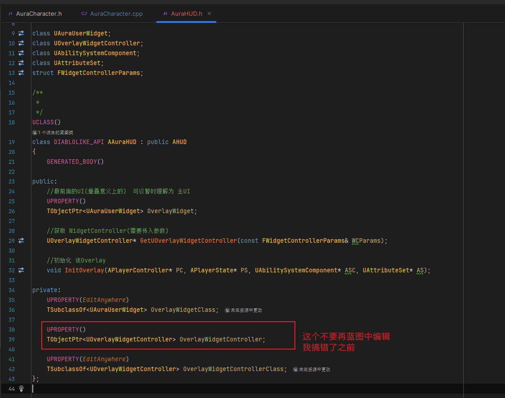
- 设置蓝图HUD
    -  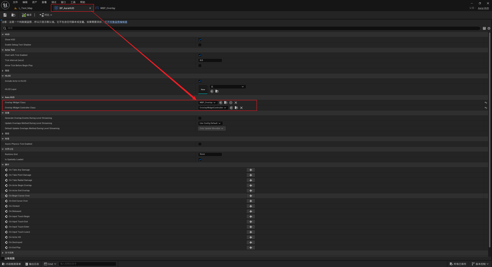
- 在角色中通过HUD初始化WidgetController中的结构体，从而完成对WidgetController中数据的初始化
    -  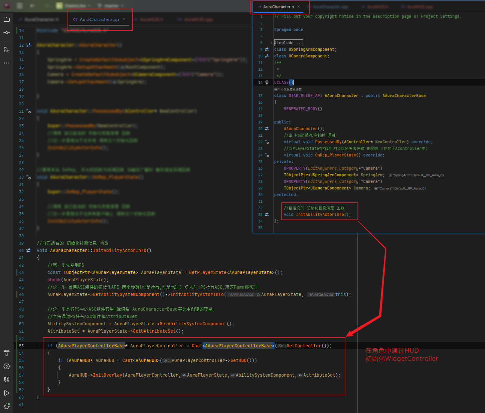
- 关键点：结构
- 下面是结构梳理：
- MVC(Model->四大数据PC/PS/ASC/AS；View->AuraUserWidget；Control->WidgetController)+使用发布更新的架构