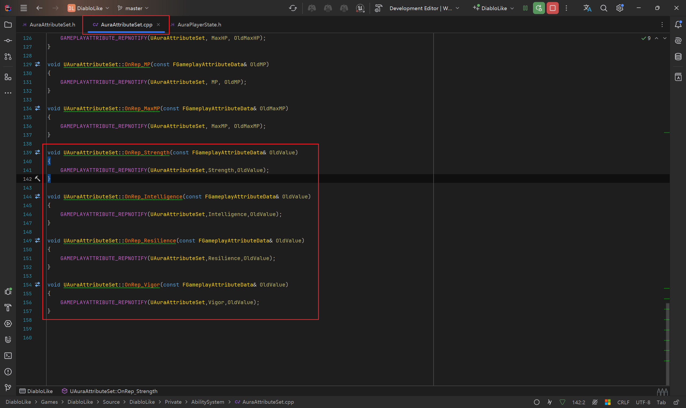
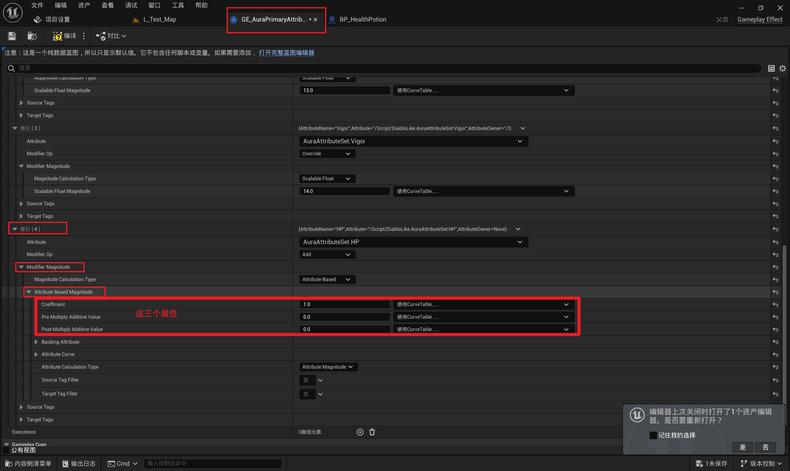

# GAS 3.4 配表 初始化属性；GE中的Modifiers中的Coefficient（简单属性计算）
- **初始化属性的三种方法**
- **方法一** **：在构造中赋值**
    -  
- **方法二** **：配表 初始化属性**
    - 创建BP的PS并配置
        -  
    - UAuraAttributeSet 中添加人物主要属性：力量/智力/坚韧/活力
        - 头文件
            -  
            -  
        - 源文件
            -  
            -  
    - AAuraPlayerState 中设置ASC组建为可读(这样就能配表了)
        -  
    - 创建并配置表格
        -  
        -  
        -  
        -  
    - BP_AuraPlayerState中配置表格
        -  
    - 运行游戏，初始化属性成功 
    - **配表 虽然方便，但是缺点也很明显，这里只能起到初始化的作用，最大最小值无效，不如别的地方功能性更强**
- 移除配表 配表只做了解
    -  
    - 看到属性归零
        -  
- **方法三** **：使用GE初始化属性**
    - AAuraCharacterBase 中，增加蓝图可配置的初始化属性的GE类，和初始化调用GE的函数
        -  
        -  
        - **根据GE类，创建GE Spec并应用到自身**
            - `**const FGameplayEffectContextHandle GameplayEffectContextHandle = GetAbilitySystemComponent()->MakeEffectContext();const FGameplayEffectSpecHandle GameplayEffectSpec = GetAbilitySystemComponent()->MakeOutgoingSpec(这里是GE类, 1.0f, GameplayEffectContextHandle);GetAbilitySystemComponent()->ApplyGameplayEffectSpecToSelf(*GameplayEffectSpec.Data.Get());**`
            -  
    - AAuraCharacter 的 `**InitAbilityActorInfo()**` 函数中调用
        -  
    - 创建文件夹
        -  
        -  
    - AbilitySystem \ GameplayEffects \ PrimaryAttributes文件夹下创建初始化用的GE文件
        -  
        -  
    - 别忘了给BP_Aura 配置DefaultPrimaryAttributes(使用初始化用的GE   GE_AuraPrimaryAttributes)
        -  
    -  
- 帮助理解的小案例
    - 创建一个Actor 拥有组件BoxCollision jueseOverlap时触发GE 根据角色属性触发-HP的逻辑
        - 新建文件夹/Actor/GE
            -  
            -  
            -  
            -  
            -  
            -  
            -  
            -  
        - 设置GE
            -  
    - 结果
        -  
    - 属性 
- **GE中的Modifiers（简单属性计算）**
    - 如果有三个Modifier，分别根据人物活力/力量/坚韧，触发加血的GE逻辑
        -  
    - 严格按照下标的顺序进行 逻辑运算
        -  
- **GE** **中的** **Modifiers** **中的** **Coefficient**
    -  
    -  
    -  
    -  
    -  