# GAS 4.2 创建蓝图函数库
- **处理关键点：UFUNCTION(BlueprintPure,Category="AuraAbilitySystemLibrary|WidgetController",meta=(WorldContext="WorldContextObject"))**
    - **1.UFUNCTION(BlueprintPure)表示该函数可以在蓝图中被调用并且是一个纯函数。**
    - **2.若形参中 有const UObject* WorldContextObject这个作为世界上下文，上面的宏UFUNCTION(meta=(WorldContext="WorldContextObject"))，可以自动识别函数的世界上下文**
    - **3.拿数据：PS从PC拿，ASC和AS从PS拿（因为在PS中创建）**
- 创建蓝图函数库 UAuraAbilitySystemLibrary
    -  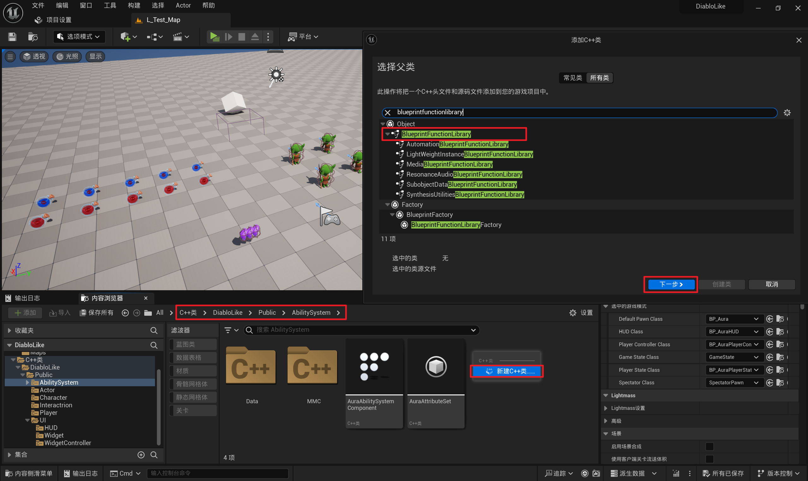
    -  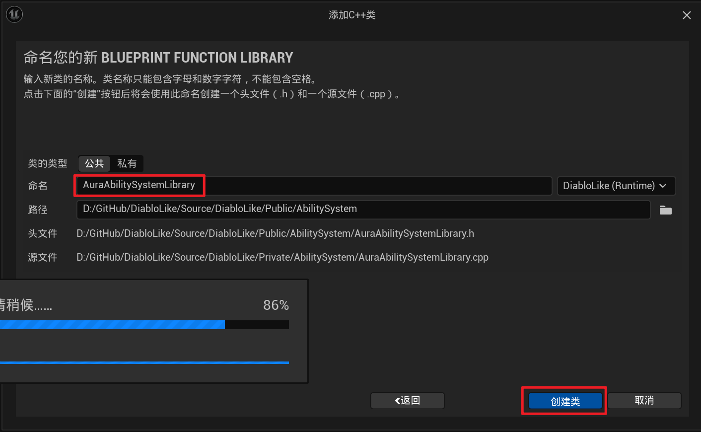
    - BlueprintPure表示该函数可以在蓝图中被调用并且是一个纯函数。 
    -  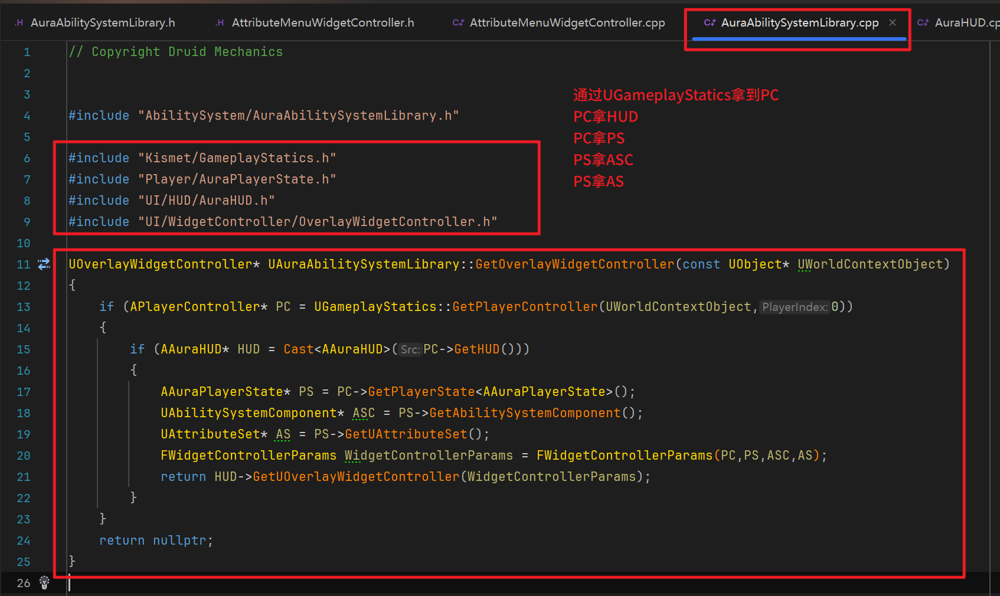
- 小测试：蓝图函数库中创建一个获取UAttributeMenuWidgetController的全局静态函数(HUD中也要创建获取的函数) 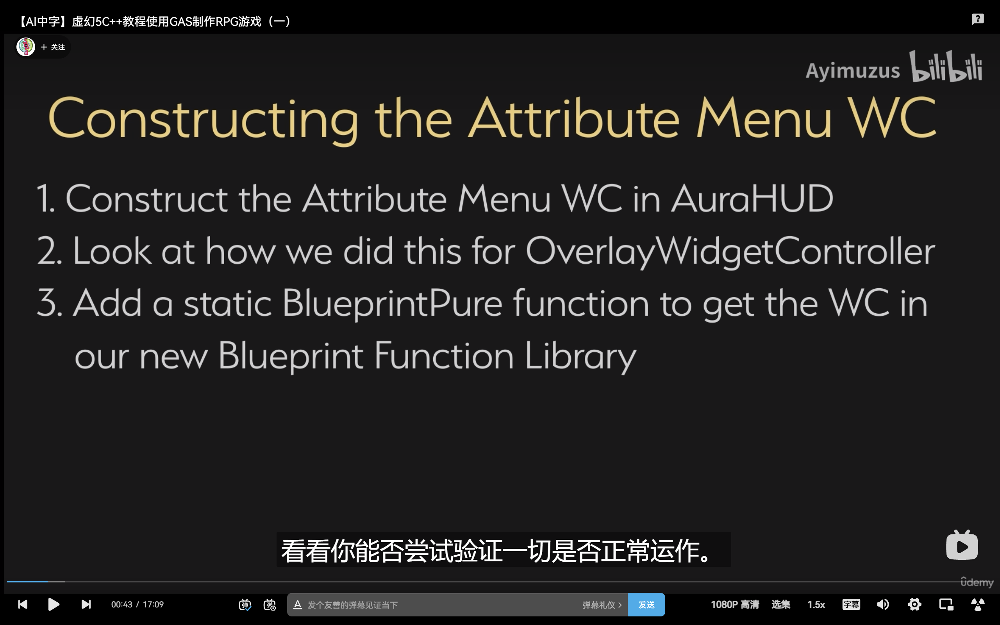
    - 自己试一下
        -  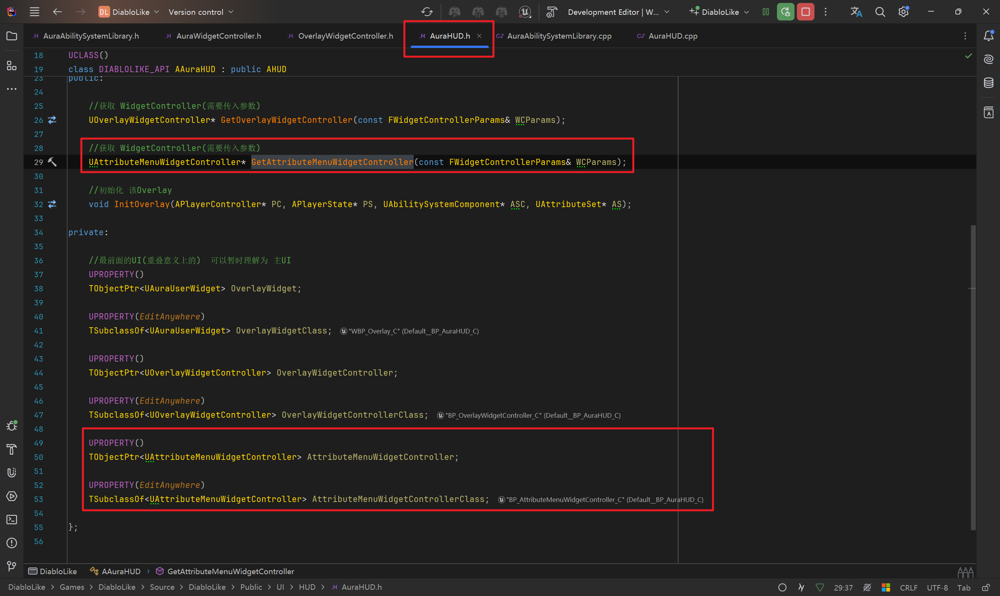
        -  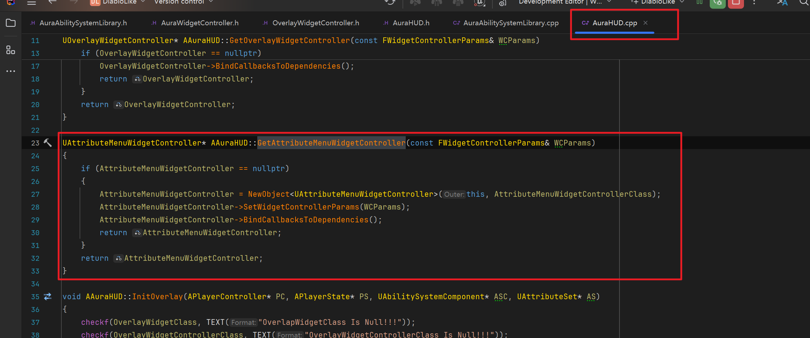
        -  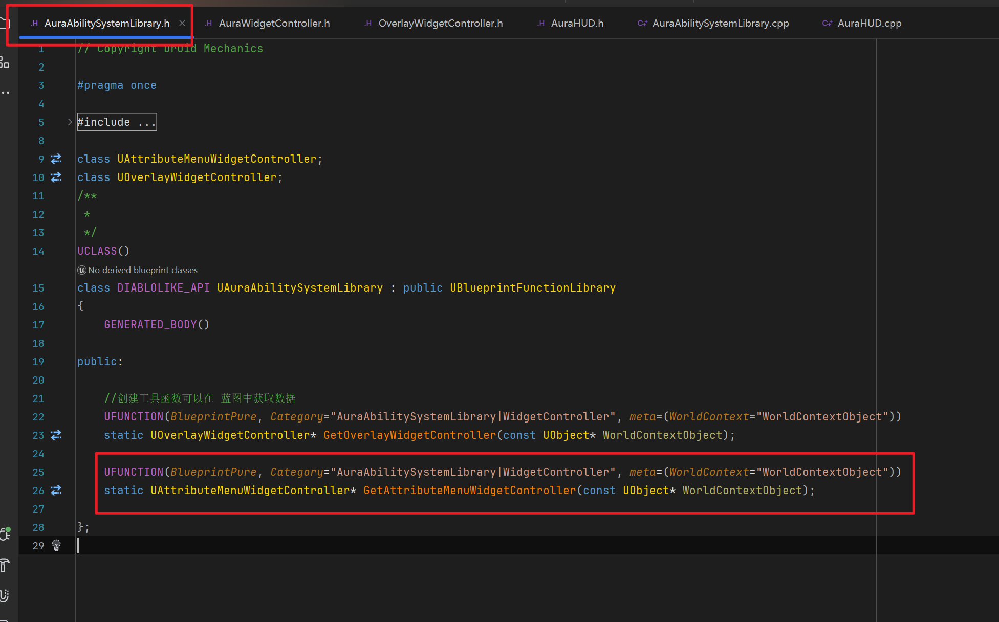
        -  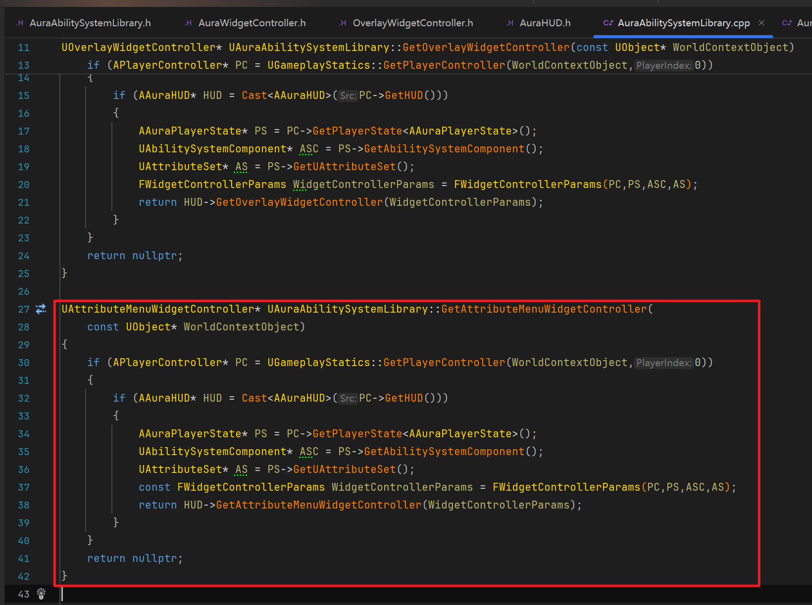
        -  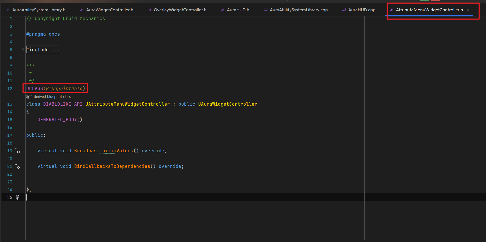
        -  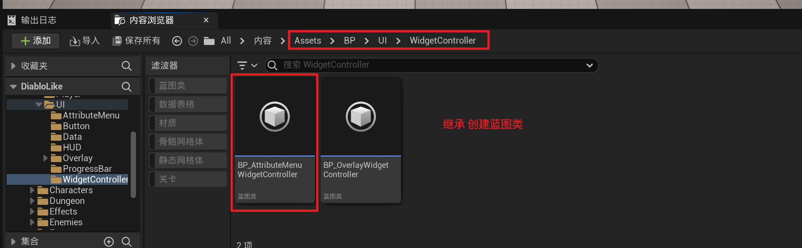
        -  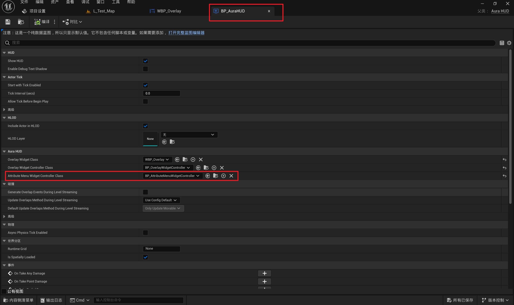
        -  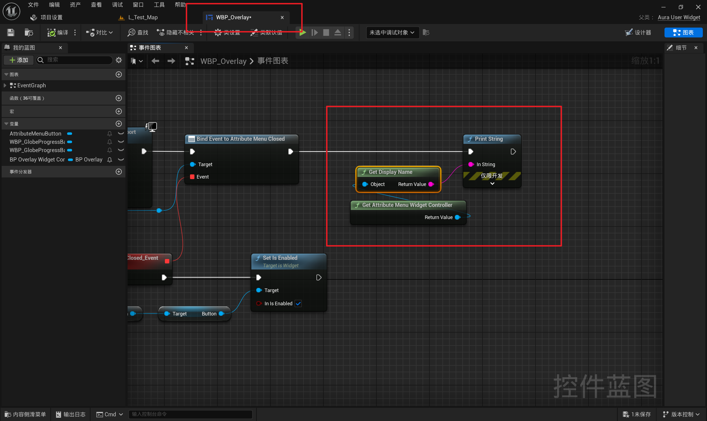
        - 测试 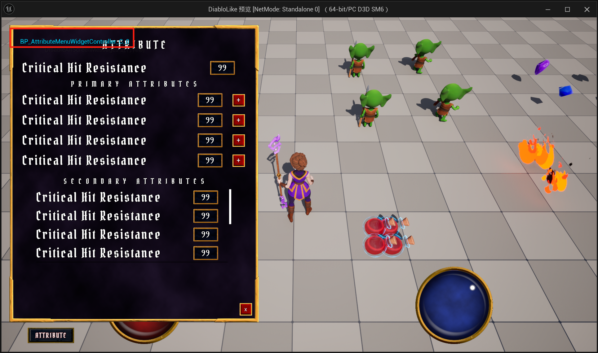