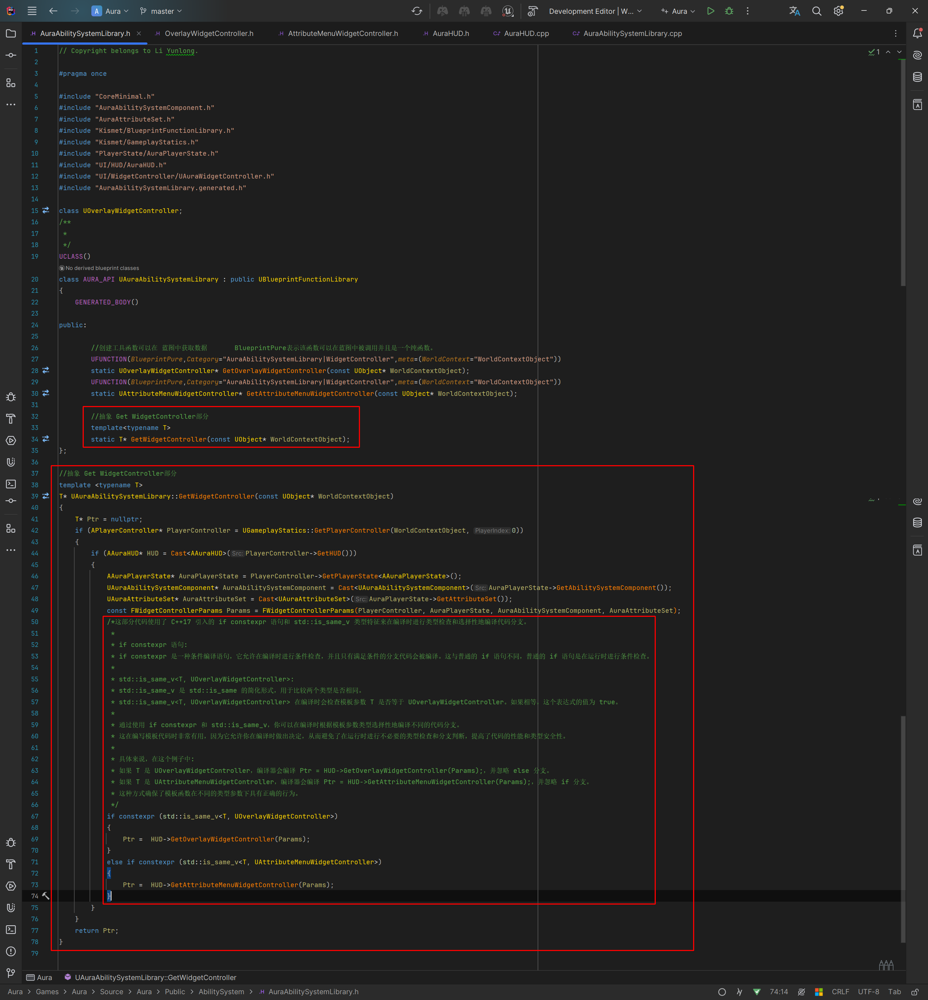
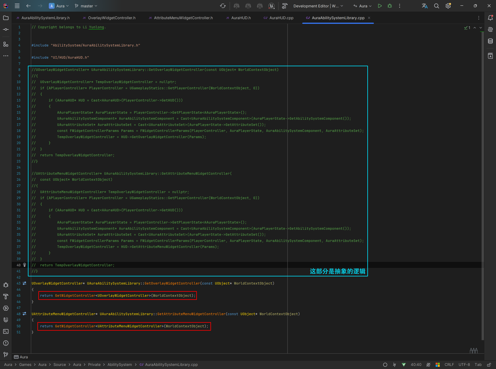
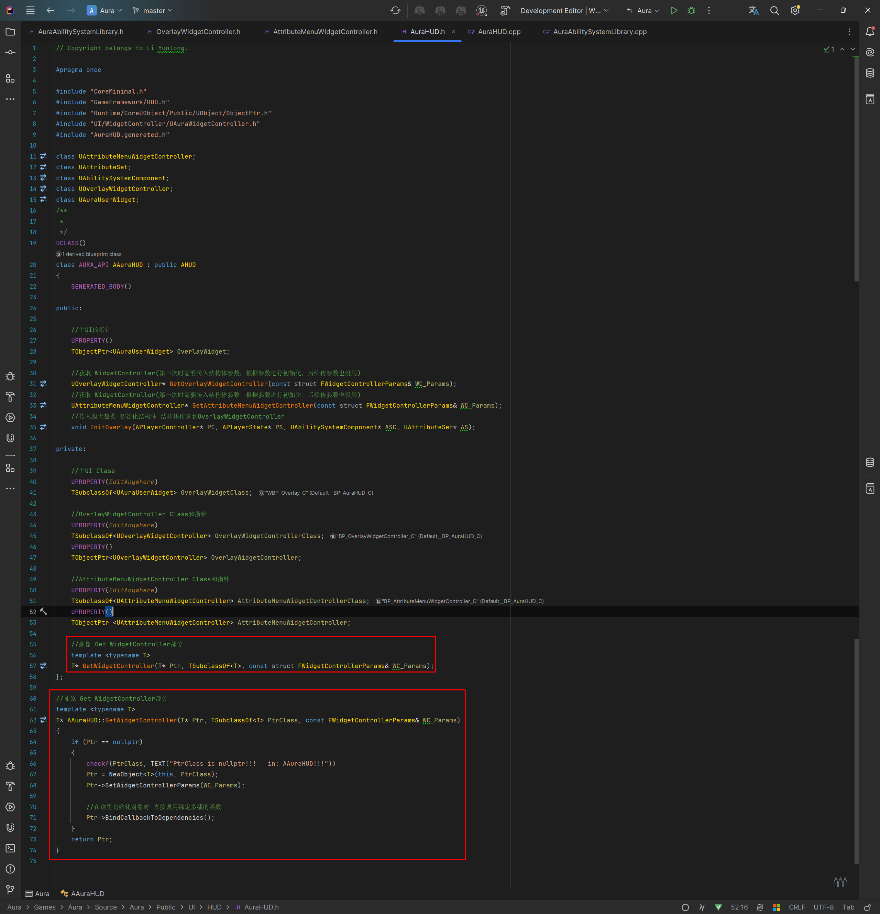
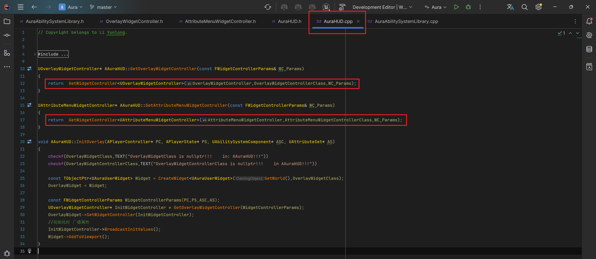

# GAS 4.29 创建模板函数——抽象  UAuraAbilitySystemLibrary 里面获取WidgetController的部分
- **处理关键点：**
    - **1.模板函数的使用**
    - **2.if constexpr 是一种条件编译语句，它允许在编译时进行条件检查，并且只有满足条件的分支代码会被编译。这与普通的 if 语句不同，普通的 if 语句是在运行时进行条件检查。示例：**
        - `**if constexpr (std::is_same_v<T, UOverlayWidgetController>){Ptr = HUD->GetOverlayWidgetController(Params);}else if constexpr (std::is_same_v<T, UAttributeMenuWidgetController>){Ptr = HUD->GetAttributeMenuWidgetController(Params);}**`
        -  
            - /*这部分代码使用了 C++17 引入的 if constexpr 语句和 std::is_same_v 类型特征来在编译时进行类型检查和选择性地编译代码分支。 *  * if constexpr 语句: * if constexpr 是一种条件编译语句，它允许在编译时进行条件检查，并且只有满足条件的分支代码会被编译。这与普通的 if 语句不同，普通的 if 语句是在运行时进行条件检查。 *  * std::is_same_v<T, UOverlayWidgetController>: * std::is_same_v 是 std::is_same 的简化形式，用于比较两个类型是否相同。 * std::is_same_v<T, UOverlayWidgetController> 在编译时会检查模板参数 T 是否等于 UOverlayWidgetController。如果相等，这个表达式的值为 true。 * * 通过使用 if constexpr 和 std::is_same_v，你可以在编译时根据模板参数类型选择性地编译不同的代码分支。 * 这在编写模板代码时非常有用，因为它允许你在编译时做出决定，从而避免了在运行时进行不必要的类型检查和分支判断，提高了代码的性能和类型安全性。 *  * 具体来说，在这个例子中: * 如果 T 是 UOverlayWidgetController，编译器会编译 Ptr = HUD->GetOverlayWidgetController(Params);，并忽略 else 分支。 * 如果 T 是 UAttributeMenuWidgetController，编译器会编译 Ptr = HUD->GetAttributeMenuWidgetController(Params);，并忽略 if 分支。 * 这种方式确保了模板函数在不同的类型参数下具有正确的行为。 */
- 蓝图函数库UAuraAbilitySystemLibrary中，使用if constexpr 语句
    - 头文件
        -  
            - /*这部分代码使用了 C++17 引入的 if constexpr 语句和 std::is_same_v 类型特征来在编译时进行类型检查和选择性地编译代码分支。 *  * if constexpr 语句: * if constexpr 是一种条件编译语句，它允许在编译时进行条件检查，并且只有满足条件的分支代码会被编译。这与普通的 if 语句不同，普通的 if 语句是在运行时进行条件检查。 *  * std::is_same_v<T, UOverlayWidgetController>: * std::is_same_v 是 std::is_same 的简化形式，用于比较两个类型是否相同。 * std::is_same_v<T, UOverlayWidgetController> 在编译时会检查模板参数 T 是否等于 UOverlayWidgetController。如果相等，这个表达式的值为 true。 * * 通过使用 if constexpr 和 std::is_same_v，你可以在编译时根据模板参数类型选择性地编译不同的代码分支。 * 这在编写模板代码时非常有用，因为它允许你在编译时做出决定，从而避免了在运行时进行不必要的类型检查和分支判断，提高了代码的性能和类型安全性。 *  * 具体来说，在这个例子中: * 如果 T 是 UOverlayWidgetController，编译器会编译 Ptr = HUD->GetOverlayWidgetController(Params);，并忽略 else 分支。 * 如果 T 是 UAttributeMenuWidgetController，编译器会编译 Ptr = HUD->GetAttributeMenuWidgetController(Params);，并忽略 if 分支。 * 这种方式确保了模板函数在不同的类型参数下具有正确的行为。 */
    - 源文件
        -  
- 错误示范！！！：HUD **AAuraHUD** 中这么干，无法判断空指针，每次都会实例化
    - 头文件
        -  
    - 源文件
        -  