# GAS 4.5 授予能力GA
- **处理关键点**
    - **1.只有服务器才能赋予技能**
    - **2.学习技能时，先使用GA的Class创建FGameplayabilitySpec技能规范**
        - **然后调用API:GiveAbilityAndActivateOnce(这里传入技能规范)才能学习**
- 创建GA文件
    -  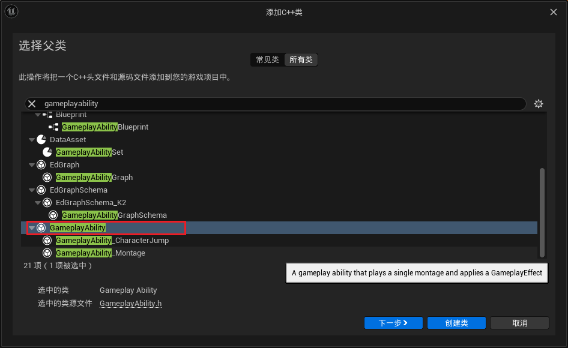
    -  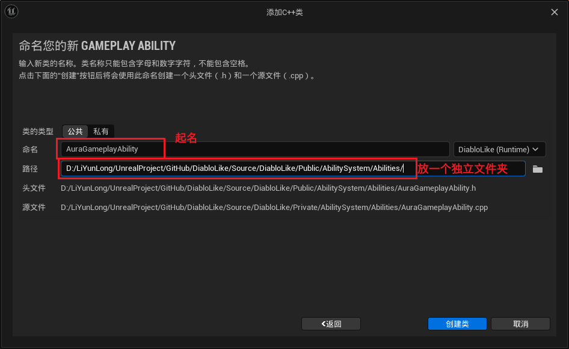
- AAuraCharacterBase 中创建 存放 技能GA类的数组，并创建需要学习技能时调用的函数 `AddCharacterAbilities()`
    -  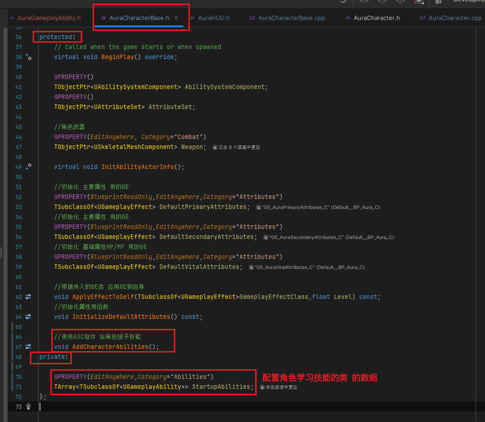
    -  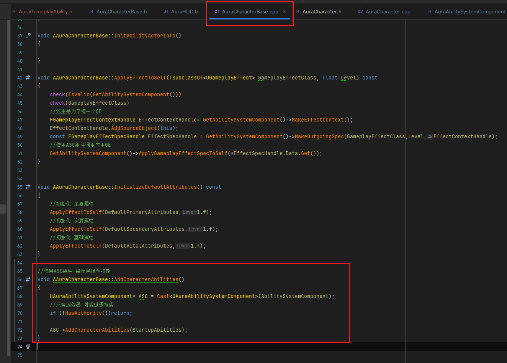
- UAuraAbilitySystemComponent 中，创建 调用时 传入要学的GA类 **数组** （ **const引用** ）函数，并学习技能
    -  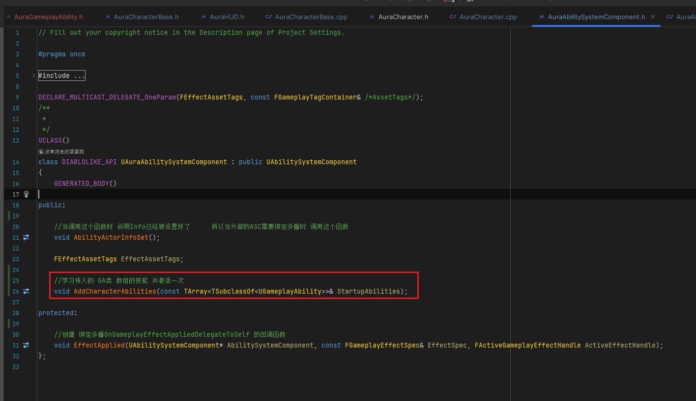
    -  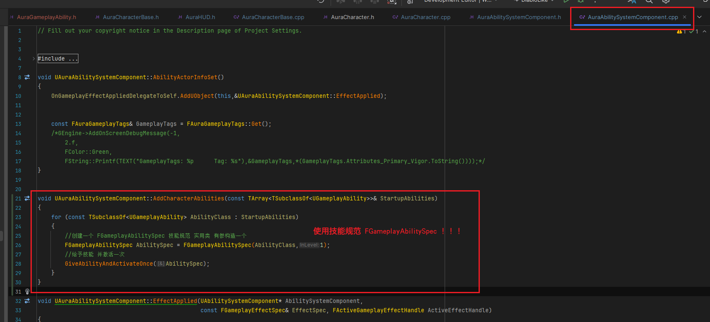
- AAuraCharacter 中，当角色PossessedBy时，调用基类中的学习技能的函数 `AddCharacterAbilities()`
    -  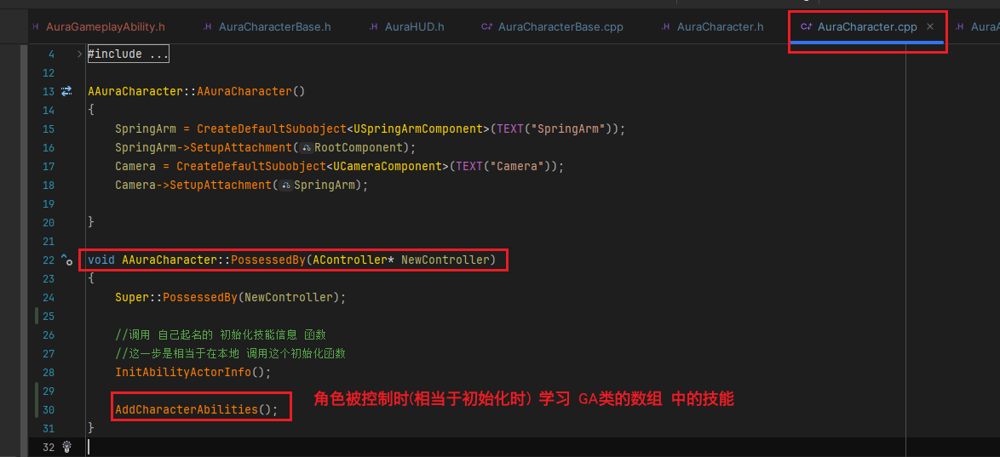
- 创建GA文件夹，并创建 测试用GA类继承自UAuraGameplayAbility
    -  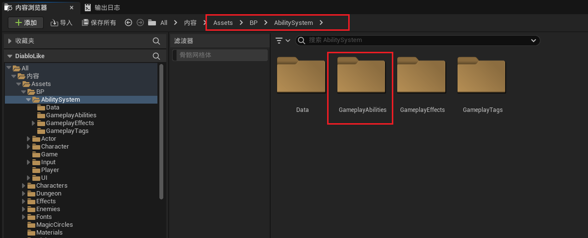
    -  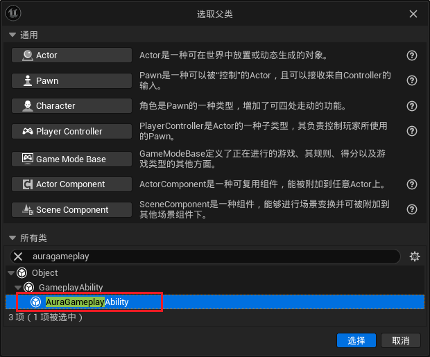
    -  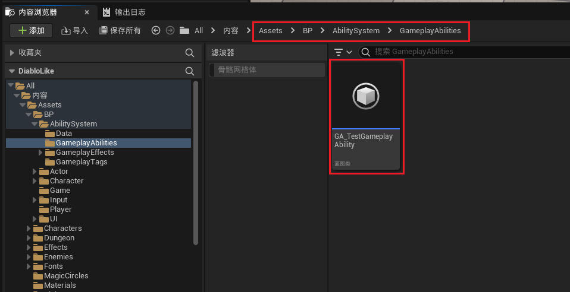
- 使用测试的GA 测试
    -  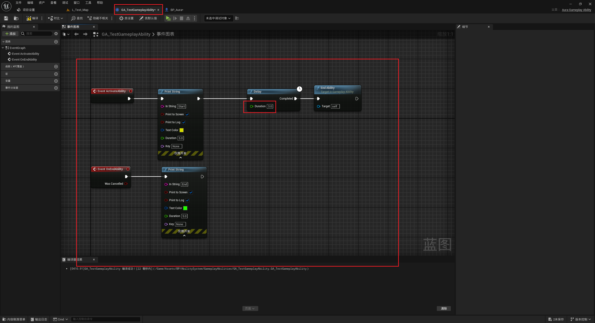
    -  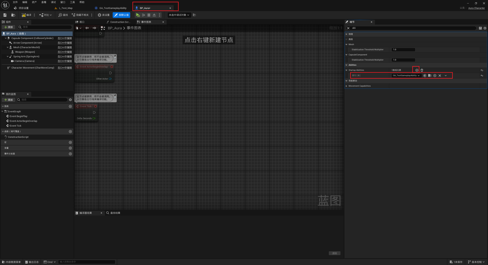
    - 测试结果 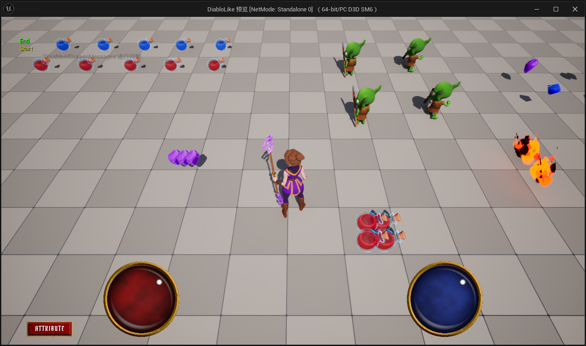