# GAS 4.7 使用数据资产将 输入 与 输入触发的Tag 绑定
- 视频链接：
    -  [4. Input Config Data Asset_哔哩哔哩_bilibili]("https://www.bilibili.com/video/BV1JD421E7yC?p=98&vd_source=9e1e64122d802b4f7ab37bd325a89e6c")
- 创建DataAsset资产
    -  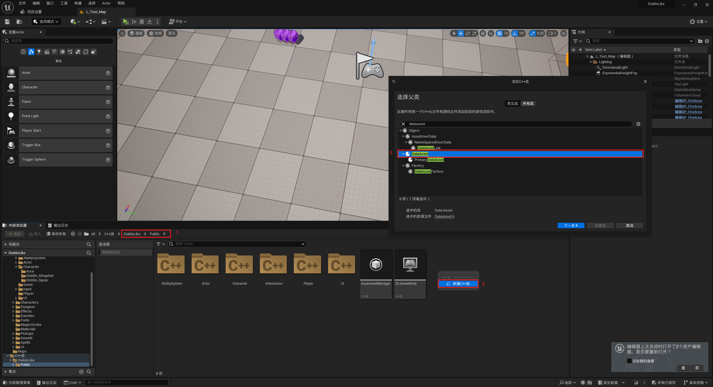
    -  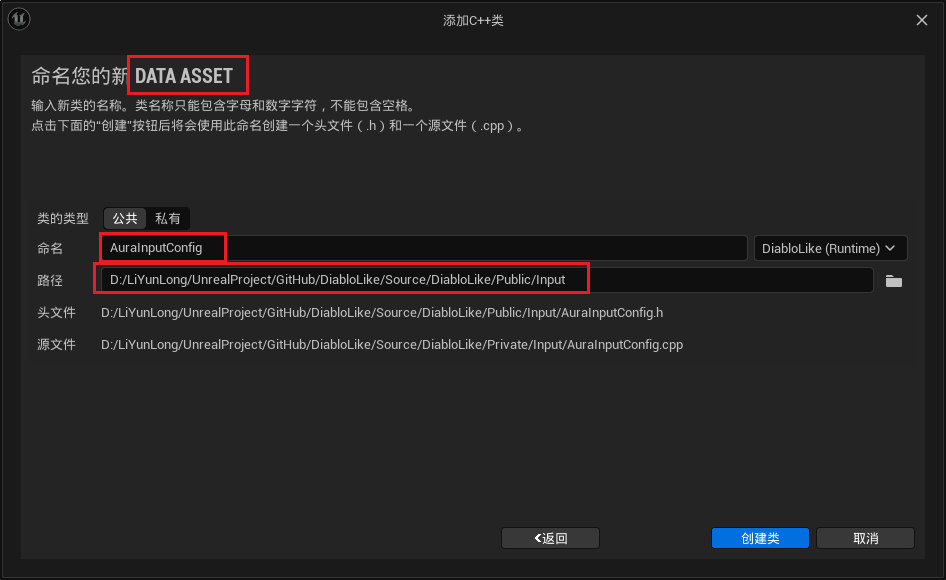
    -  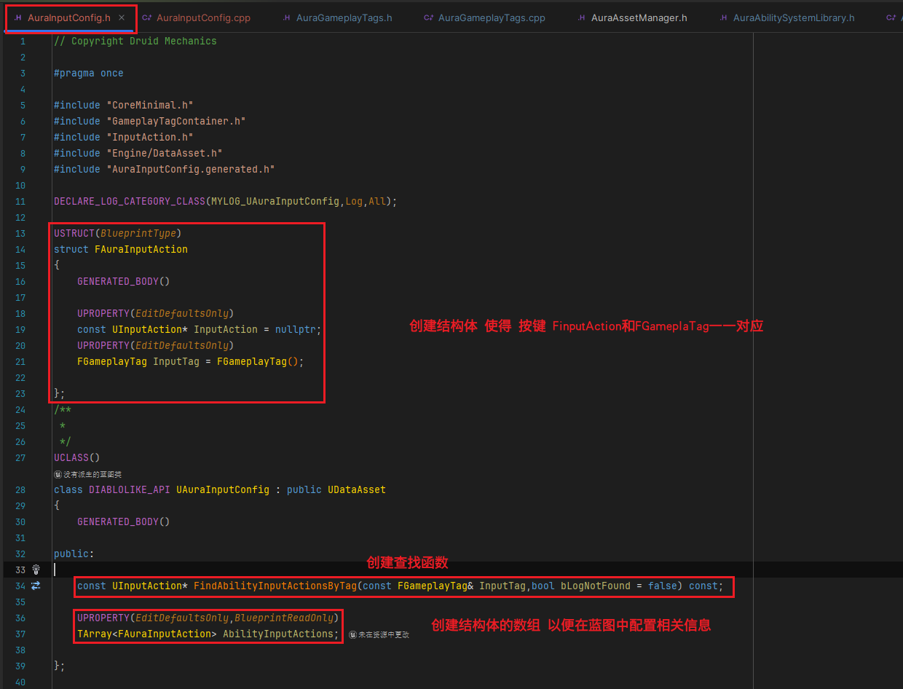
    -  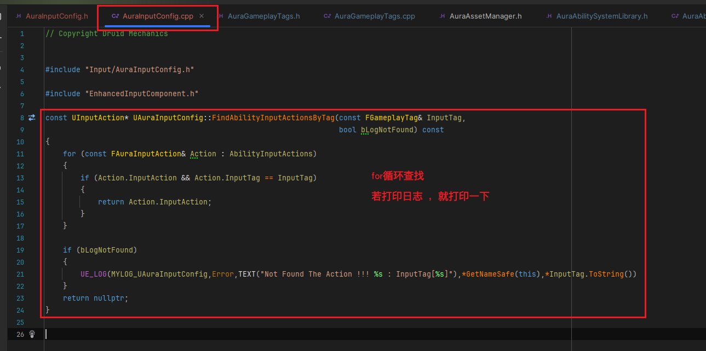
- FAuraGameplayTags中添加按键的Tag
    -  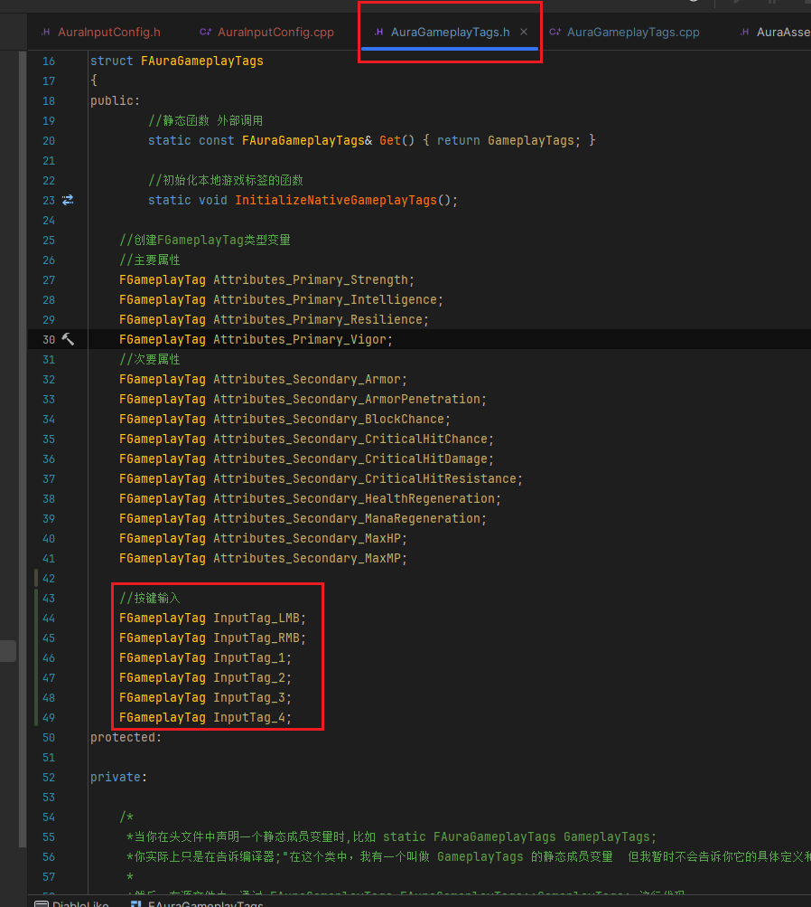
    -  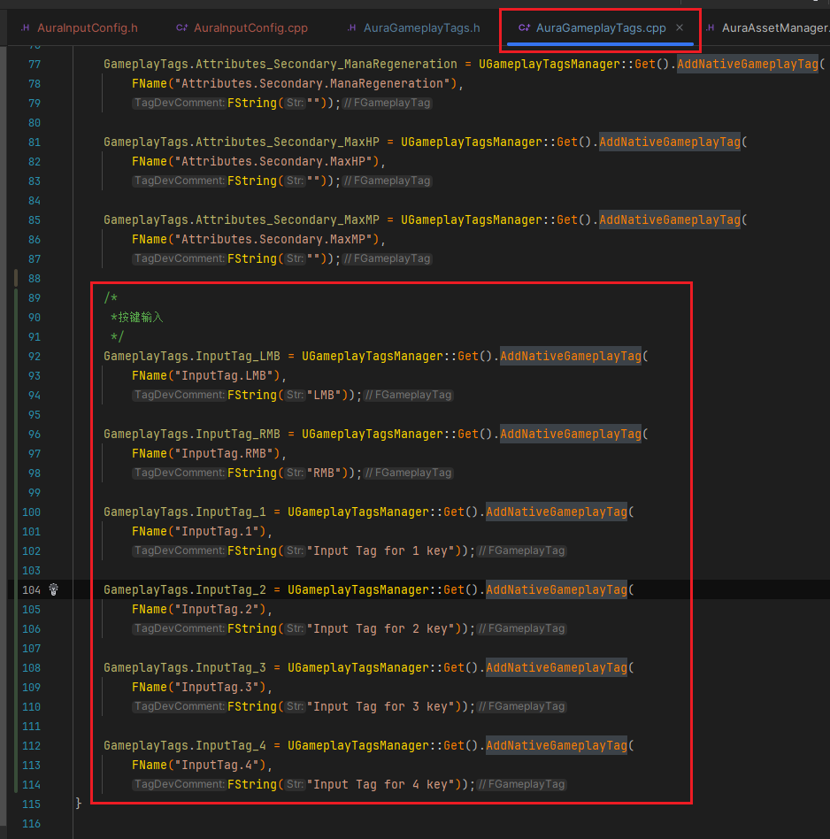
- 此时运行项目 项目设置中查看GmeplayTag，若有标签说明操作没有问题
    -  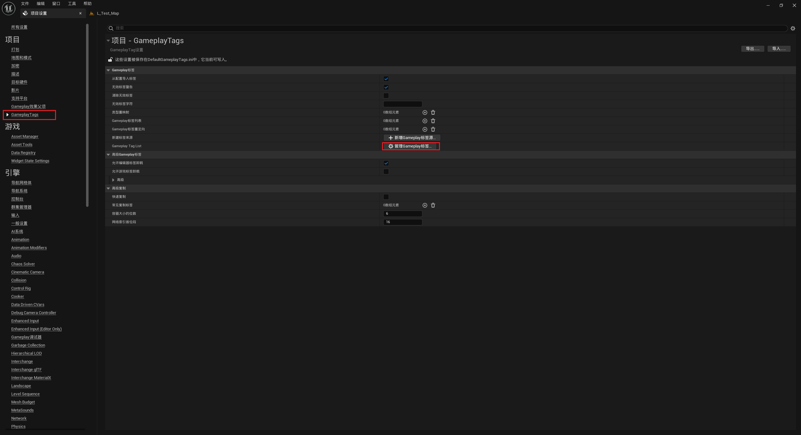
    -  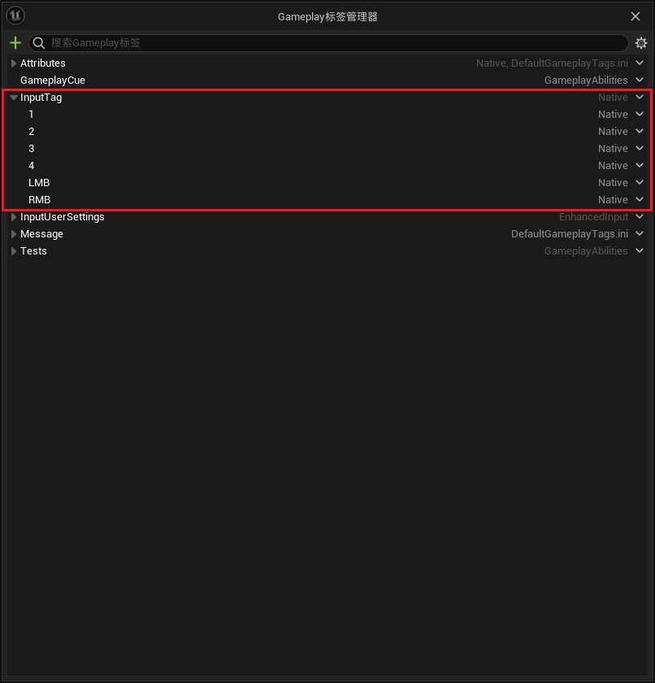
- 创建蓝图类数据资产继承自上面创建的c++类UAuraInputConfig取名DA_AuraInputConfig
    -  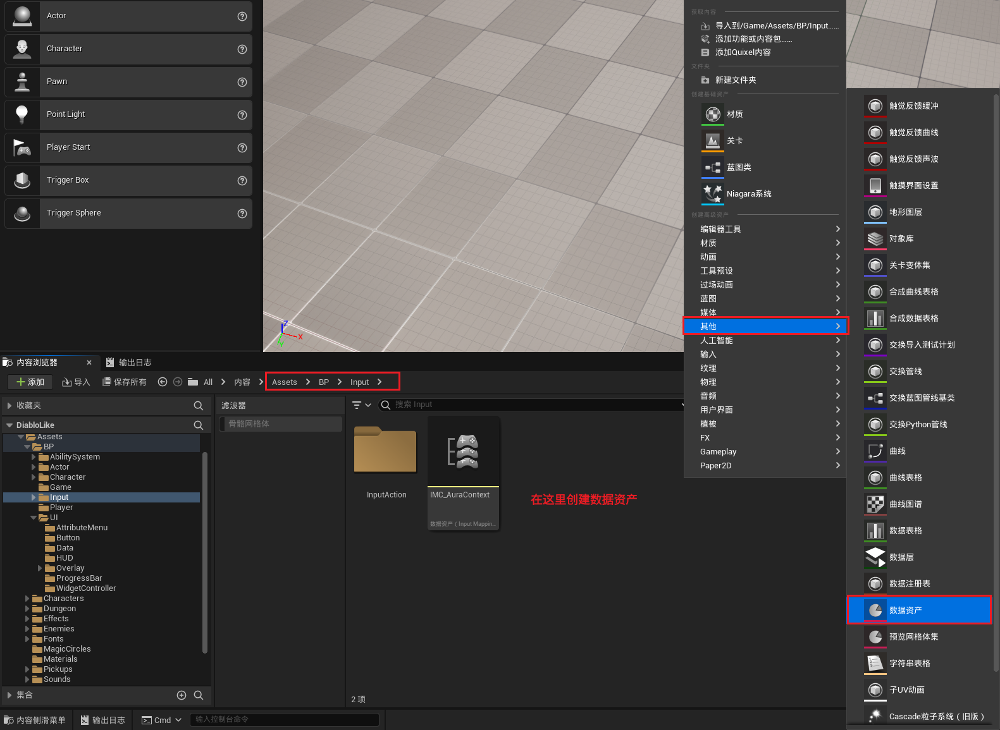
    -  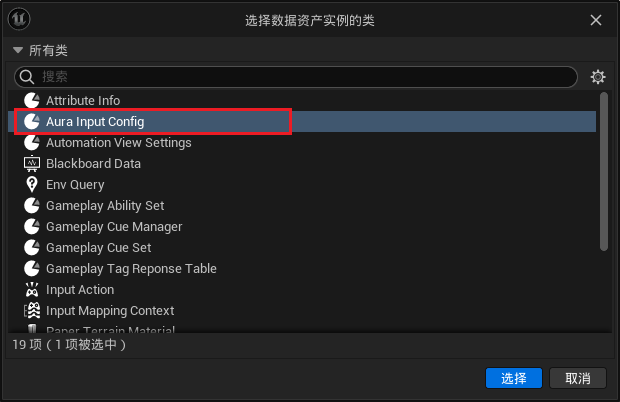
    -  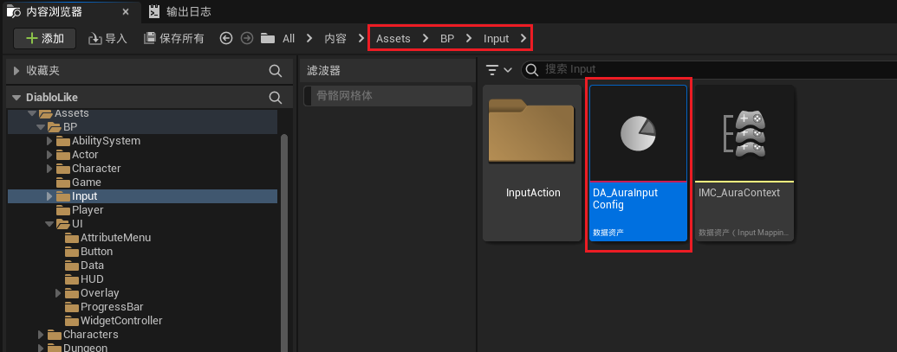
- 创建对应的InputAction
    -  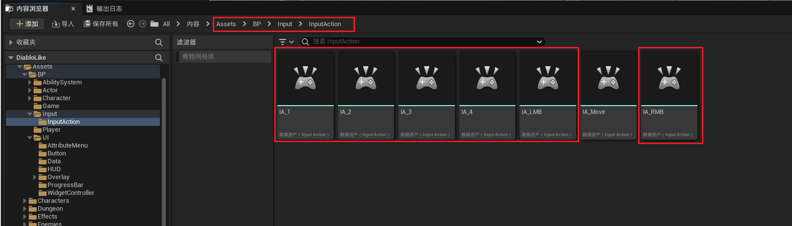
    -  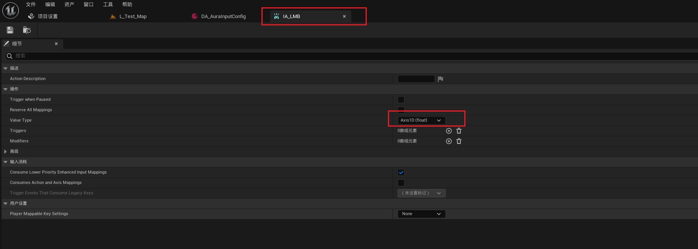
- IMC_AuraContext中配置按键输入
    -  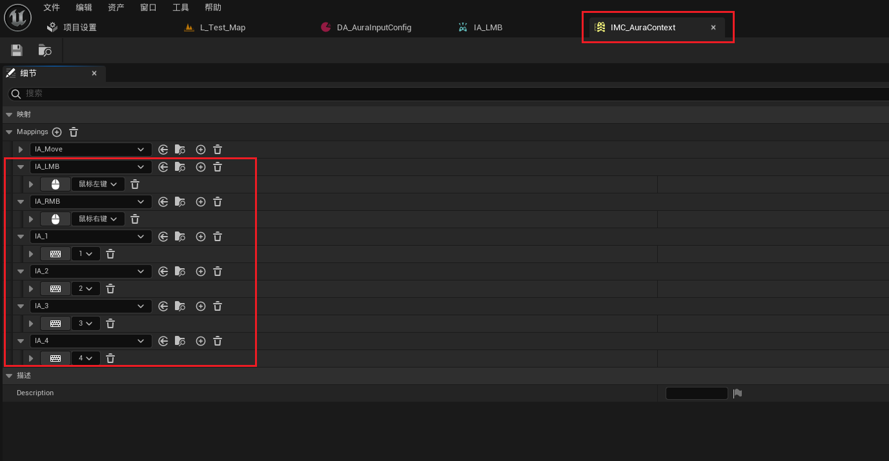
- DA_AuraInputConfig中配置 FInputAction和FGameplaTag
    -  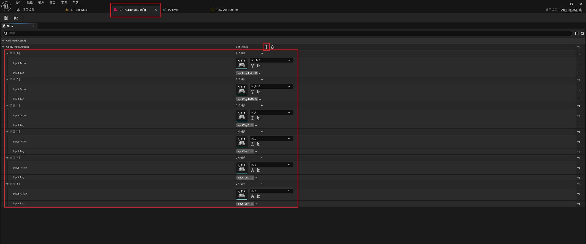