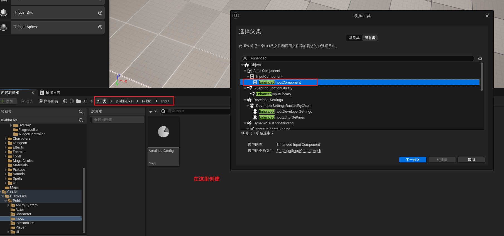
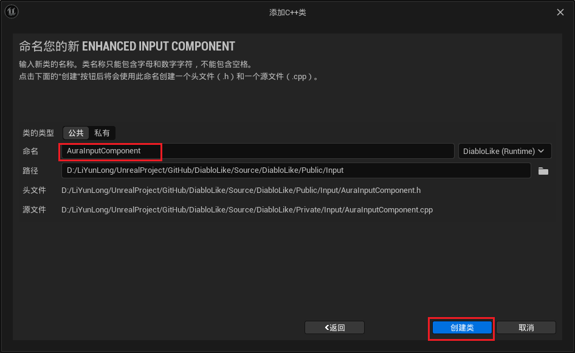
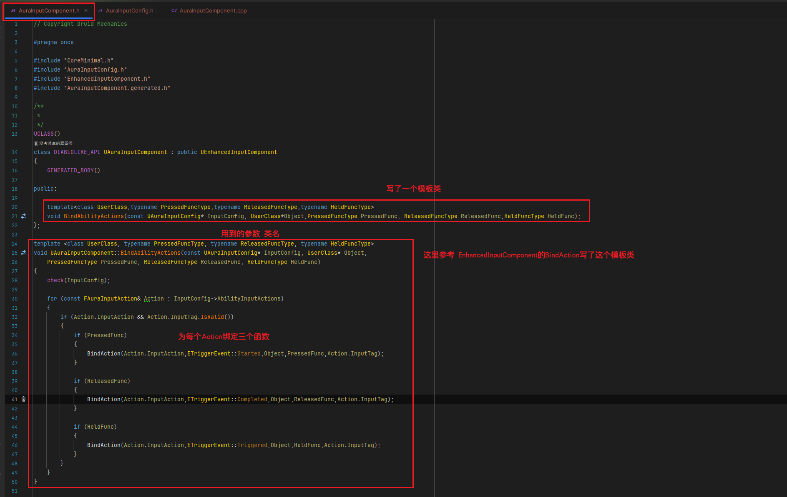

# GAS 4.8 创建自建增强输入组件，创建函数模板
- **处理关键点：**
    - **1.使用C++模板，创建了一个函数模板**
    - **2.具体参考《C++模板》**
        - 本人：在微信收藏里；
        - 别人：找我要，这里放不了，我百度云会员到期了，不想充
- 视频链接：
    -  [https://www.bilibili.com/video/BV1JD421E7yC?p=99&vd_source=9e1e64122d802b4f7ab37bd325a89e6c]("https://www.bilibili.com/video/BV1JD421E7yC?p=99&vd_source=9e1e64122d802b4f7ab37bd325a89e6c")
- 自建增强输入组件类
    -  
    -  
    -  
        - 模板参数
            - UserClass : 用于指定用户类的类型。
            - PressedFuncType , ReleasedFuncType , HeldFuncType : 用于指定按下、释放和按住事件的函数类型。
        - 函数参数
            - InputConfig : 指向 UAuraInputConfig 类型的指针，包含输入配置。
            - Object : 指向用户类实例的指针。
            - PressedFunc , ReleasedFunc , HeldFunc : 指向相应事件处理函数的指针。
        - **创建了一个函数模板，typename是声明一个类型，和class类似，但是class是一个类**
        - **bindAction是可变参数模板，理论上来说，最后一个传参数类型**