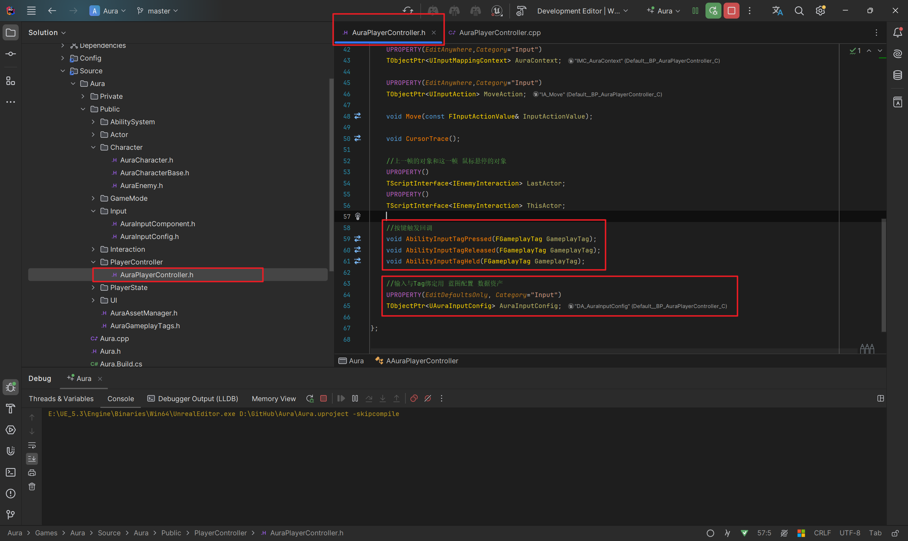
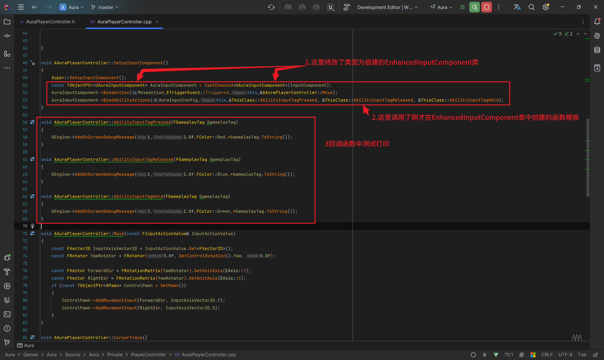
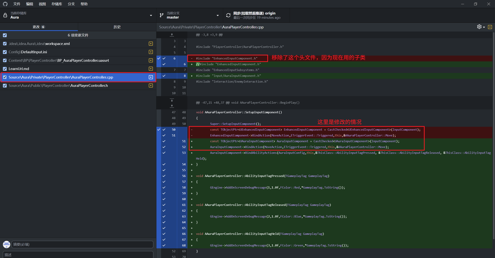
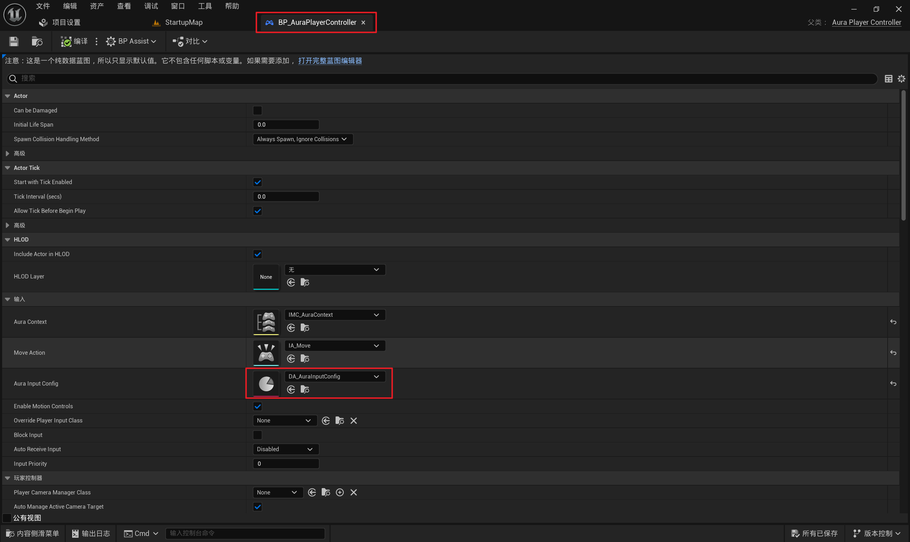
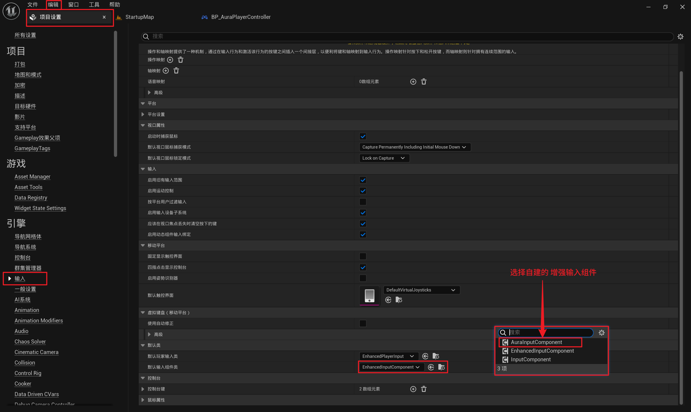
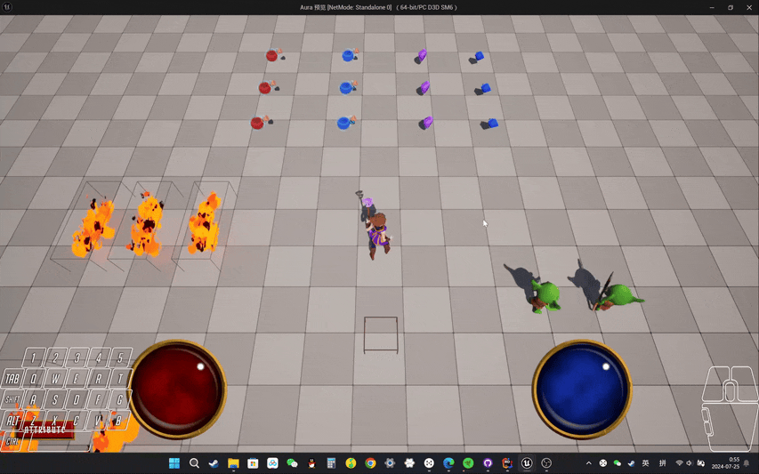

# GAS 4.9 AAuraPlayerController中为自建增强输入组件创建并绑定按键回调，引擎中配置增强输入
- **处理关键点：**
    - **1.引擎中配置增强输入：项目设置->输入->默认输入组件类**
- 视频链接：
    -  [6. Callbacks for Ability Input_哔哩哔哩_bilibili]("https://www.bilibili.com/video/BV1JD421E7yC?p=100&vd_source=9e1e64122d802b4f7ab37bd325a89e6c")
- **AAuraPlayerController** 中，添加了：1.输入与Tag绑定用 蓝图配置 数据资产2.按键触发的三个回调，分别对应：开始按下/持续按下/松开
    - 头文件
        -  
    - 源文件
        -  
            - 具体修改 
- 生效需要配置
    -  
    -  
- 此时效果gif 