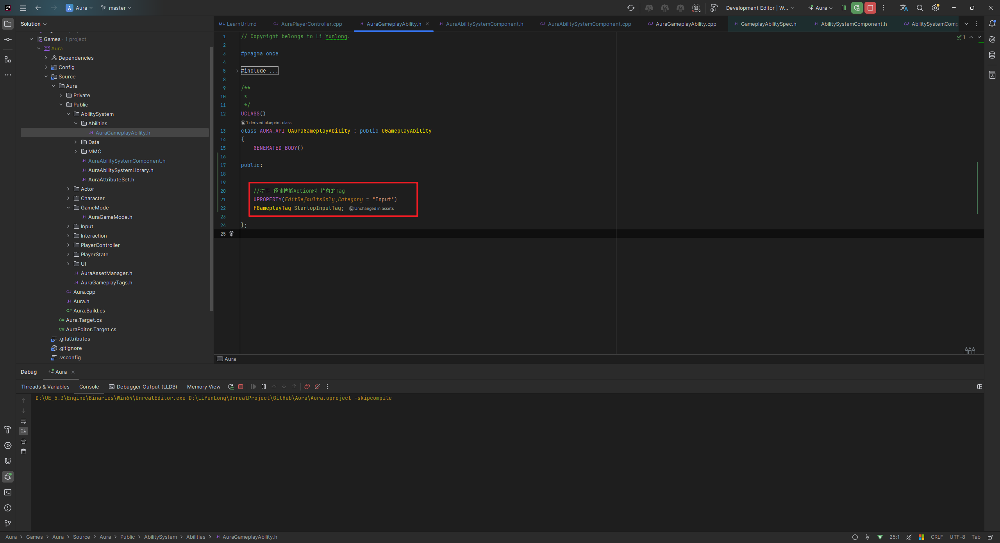
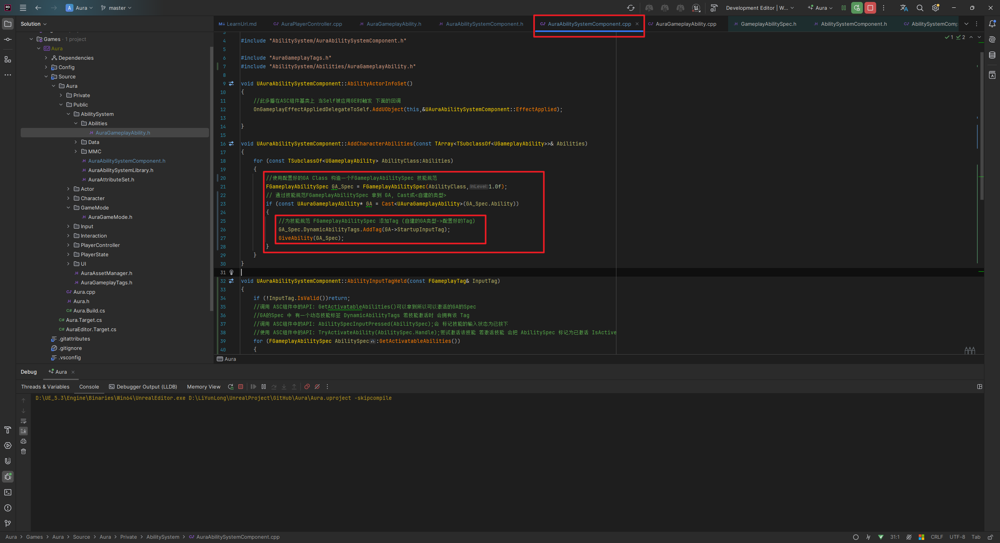
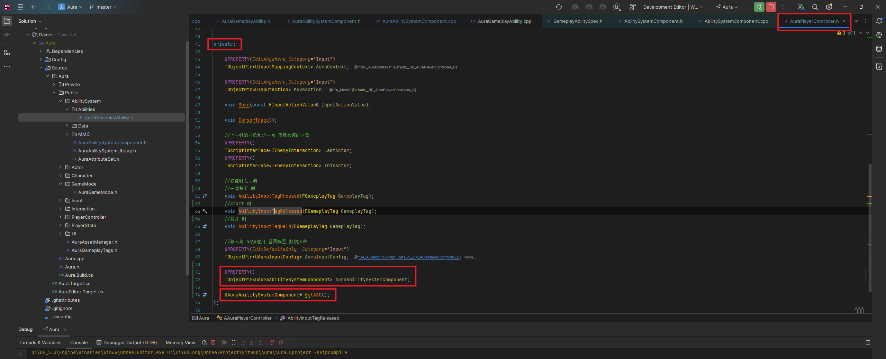
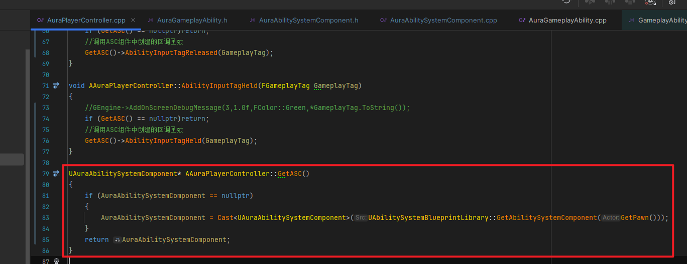
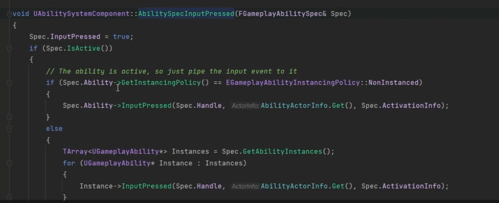
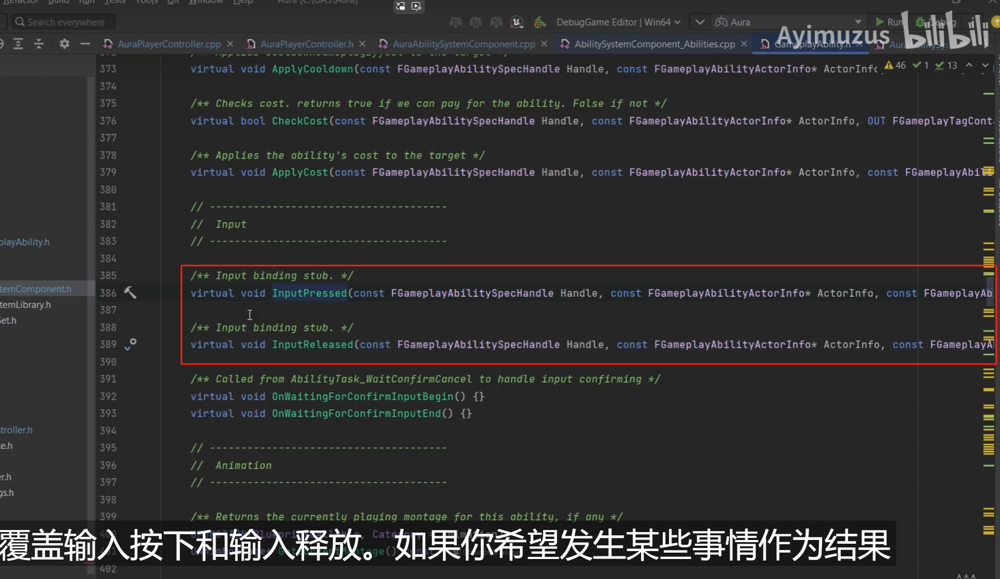

# GAS 5.0 GA中配置Tag，并在按下和松开按键时的回调函数中设置，保证释放GA时，触发并持有该Tag
- **处理关键点：**
    - **1.赋予角色技能时，给 技能GA 添加 动态标签DynamicAbilityTag**
    - **2.调用 ASC组件中的API: GetActivatableAbilities()可以拿到所以可以激活的GA的Spec**
    - **3. GA的Spec 中 有一个动态技能标签 DynamicAbilityTags 若技能激活时 会拥有该 Tag**
    - **4.调用 ASC组件中的API: AbilitySpecInputPressed(AbilitySpec);会 标记技能的输入状态为已按下**
    - **5.使用 ASC组件中的API: TryActivateAbility(AbilitySpec.Handle);尝试激活该技能 若激活技能 会把 AbilitySpec 标记为已激活 IsActive**
    - **6.** `**if (AbilitySpec.IsActive())**` **判断该技能GA是否被激活**
    - **7.使用AbilitySpec.Handle 激活该技能TryActivateAbility(AbilitySpec.Handle);**
- 视频链接：
    -  [6. Callbacks for Ability Input_哔哩哔哩_bilibili]("https://www.bilibili.com/video/BV1JD421E7yC?p=100&vd_source=9e1e64122d802b4f7ab37bd325a89e6c")
- UAuraGameplayAbility 中，内部持有 `**GameplayTag**` 变量
    - 内部持有GameplayTag变量 
- UAuraAbilitySystemComponent 中，赋予角色技能时，给 技能GA 添加 动态标签DynamicAbilityTag，创建两个松开后的回调函数，传入tag
    - 在赋予角色技能时，可以给 技能GA 添加 动态标签DynamicAbilityTag 
    - 创建两个松开后的回调函数，传入tag 
- AAuraPlayerController 中
    - 持有asc组件和创建内部获取的方法 
        - **get** 
    - 开始按下和松开的回调函数中调用ASC组件中创建的开始按下和松开的回调函数 
- UAuraAbilitySystemComponent 中
    - 参考
        - 基类ASC组件中的参考（这里是对于 默认没有实例化的GA的操作） 
        - 基类GA中的参考，虚函数可以重写 
    - **下面是关键步骤**
    -  
- ***GA*** 中配置tag
    -  