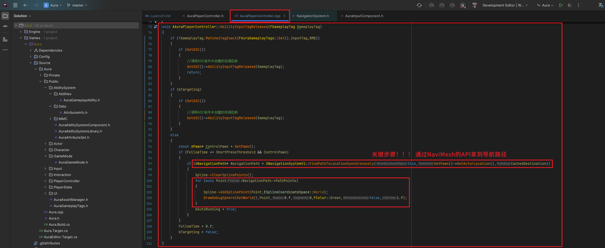
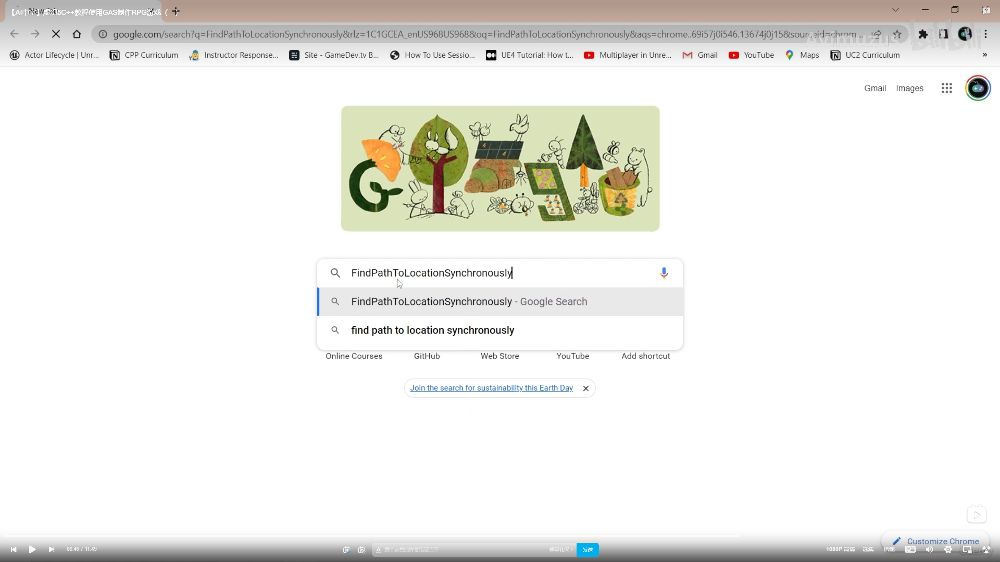
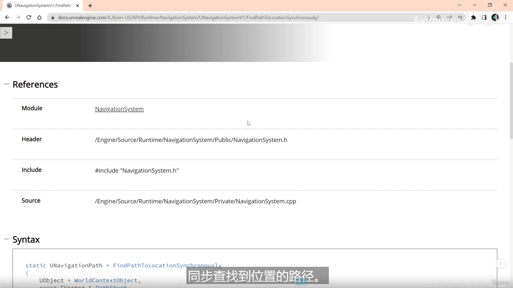
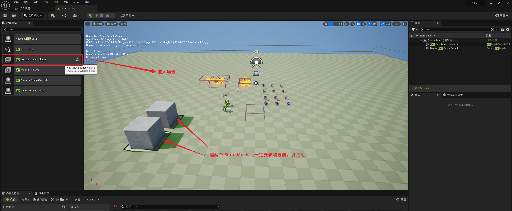

# GAS 5.2 PC短按 实现自动移动
- 视频链接
    -  [https://www.bilibili.com/video/BV1JD421E7yC?p=104&vd_source=9e1e64122d802b4f7ab37bd325a89e6c]("https://www.bilibili.com/video/BV1JD421E7yC?p=104&vd_source=9e1e64122d802b4f7ab37bd325a89e6c")
- 使用 **NaviMesh** 的 **API** 需要 **引模块** **"** **NavigationSystem** **"**
    - 需要引模块" **NavigationSystem** " 
- AAuraPlayerController 中
    - **AbilityInputTagReleased** **函数中,**
        - 如果不为左键点击tag，调用ASC组件的回调函数，然后return；若为左键点击时，if有目标，调用ASC组件的回调函数；没目标，这里才是需要处理的逻辑：
        - 先拿到控制的角色，若点击时间小于等于 阈值 且 控制角色不为空时，先清空样条线的所有点，通过 **NaviMesh** 的API： **UNavigationSystemV1::FindPathToLocationSynchronously** 拿到 **NaviMesh** 的导航路径，路径结构体中有个 **PathPoints** 数组保存了路径点的信息，遍历一下为样条线添加点，生成debug球体，然后 `bAutoRunning=true` ；然后设置记录鼠标点击时间的变量为0.f，设置 `bTargeting=false`
        -  
            - 需要引模块" **NavigationSystem** " 
- 小技巧：当你不知道一个函数的模块时，可以谷歌
    -  
    -  
    - 会定位到官方文档，哈哈哈，所以还是需要在文档里面找 
- 加入导航网格体 **Nav Mesh Bounds Volume**
    -  
- 我使用的是右键移动，此时短按右键，会Debug导航点,此时gif