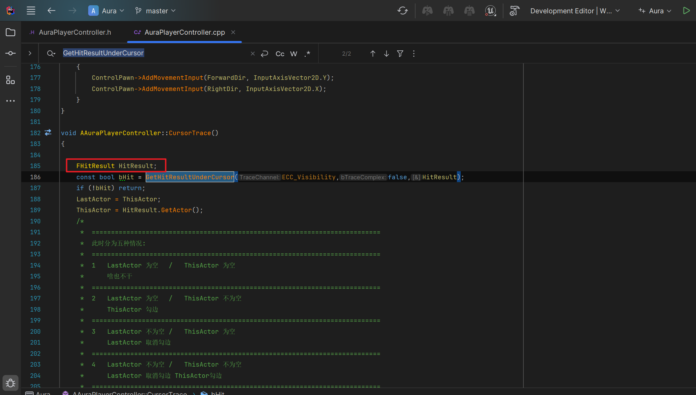
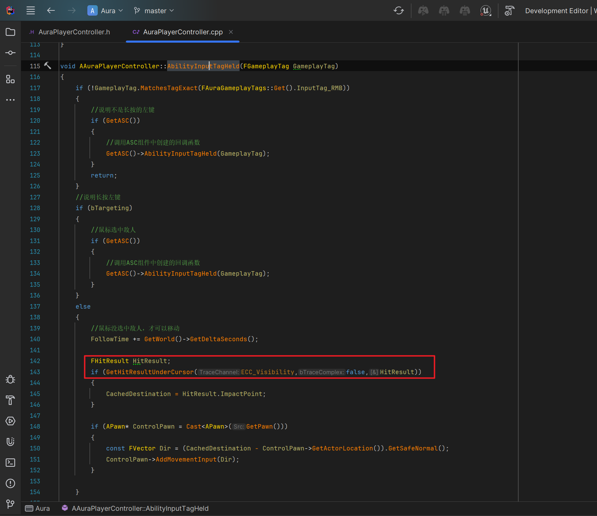
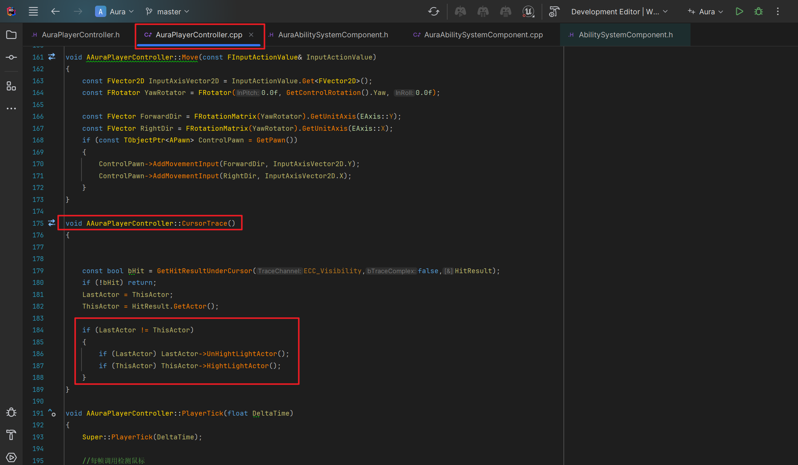
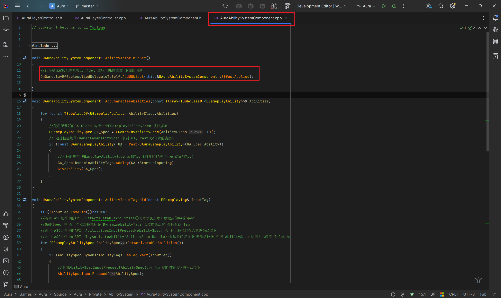
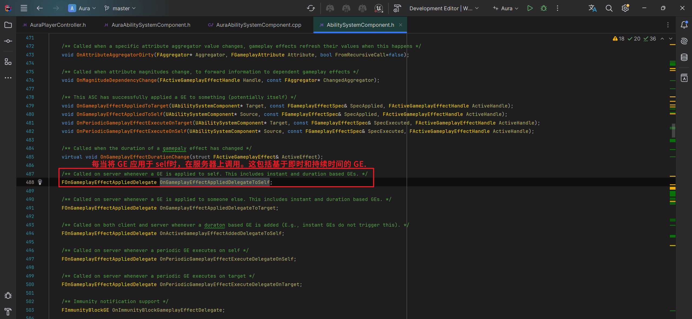
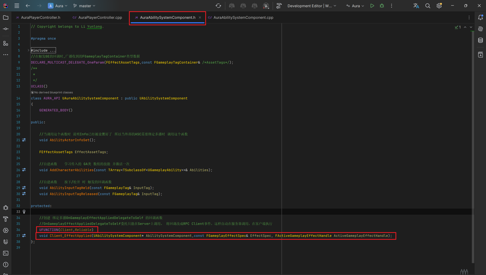
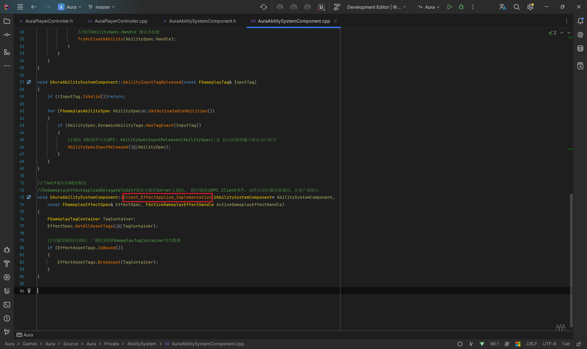
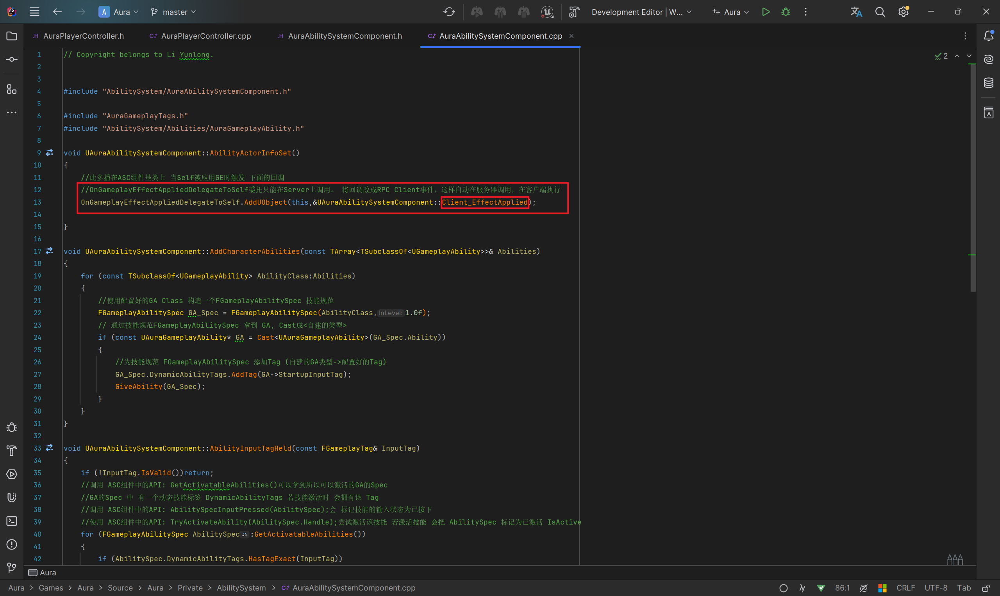
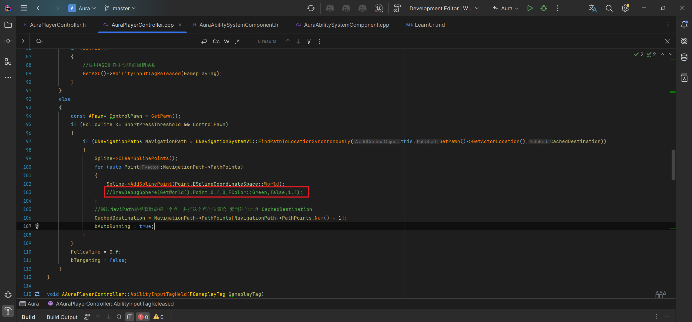

# GAS 5.4 优化PC中的逻辑 运行时勿重复获取结果 精简代码 考虑可能出现的bug
- **处理关键点:**
    - **1.优化逻辑步骤**
        - **检查有无重复获取的结果，保存变量，节约运行时开销**
        - **检查冗余代码，精简，抽象 逻辑**
        - **考虑可能出现的情况和bug,  检查优化逻辑，并修复，参考《防御式编程》**
        - **没问题后 去掉Debug和调试**
    - **2.C++中的RPC**
- 视频链接
    - 【【AI中字】虚幻5C++教程使用GAS制作RPG游戏（一）-哔哩哔哩】 [https://b23.tv/p193q3c]("https://b23.tv/p193q3c")
- 优化 AAuraPlayerController 中的逻辑
    - 目前有两处获取碰撞检测结果，保存变量，优化为一处获取，节约运行时开销
        - 自己找吧
            - 两处  
    - 勾边逻辑部分，过于冗余，优化清晰逻辑
        -  
    - 此时有一个bug：客户端无法生成UI，之前处理的链接： ​ ​  ，原因为:ASC组件中的 **OnGameplayEffectAppliedDelegateToSelf委托** 只能在Server上调用。处理方法:将回调改成RPC Client事件，这样自动在服务器调用，在客户端执行 [GAS 3.2 绑定GE委托，通过收到的的资产标签，广播信息结构体，触发UI中绑定的WidgetController回调，UI中拿到生成MessageUI的信息]("https://mubu.com/doc7RVlZQFR2M0")
        - **原因**
            -  
            -  
        - **回调改成RPC Client事件** 
            -  
            -  
    - **没问题后 去掉Debug和调试**
        -  
- **完成！此时客户端和服务器都会有拾取UI**