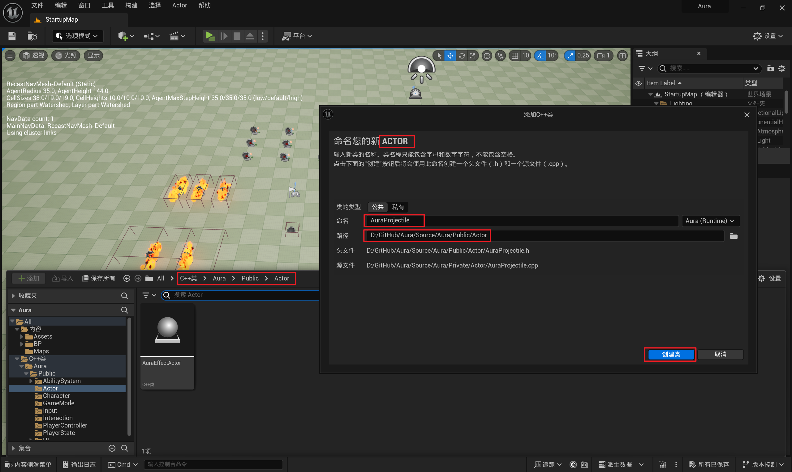
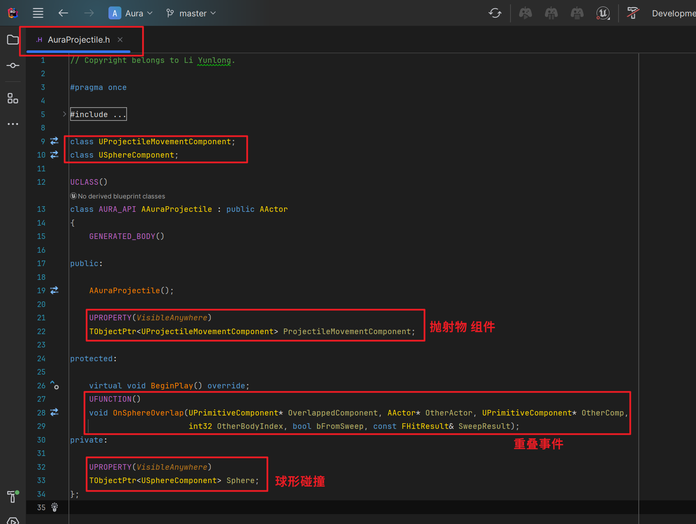
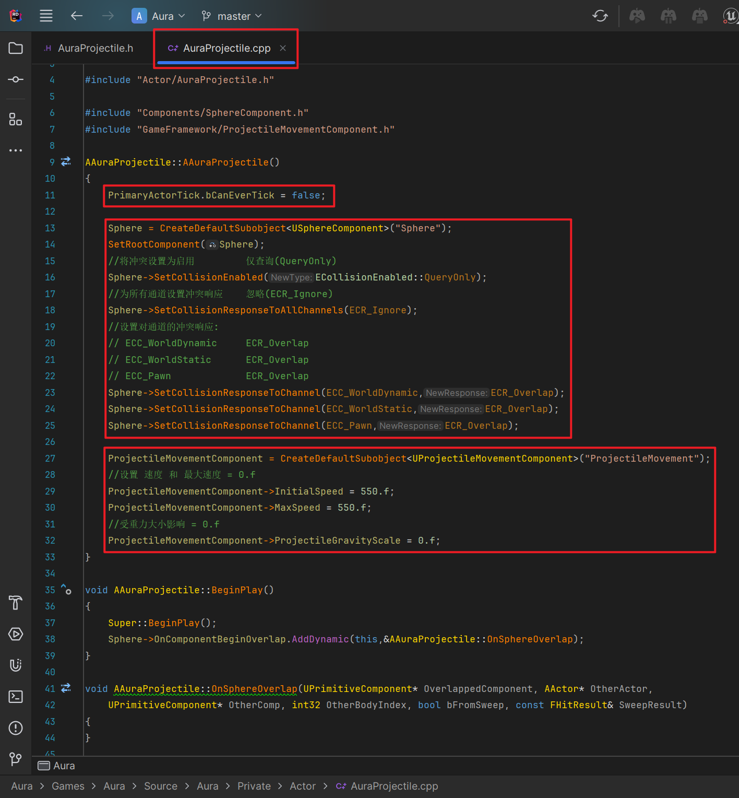
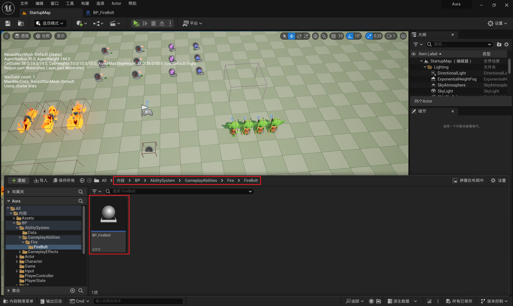
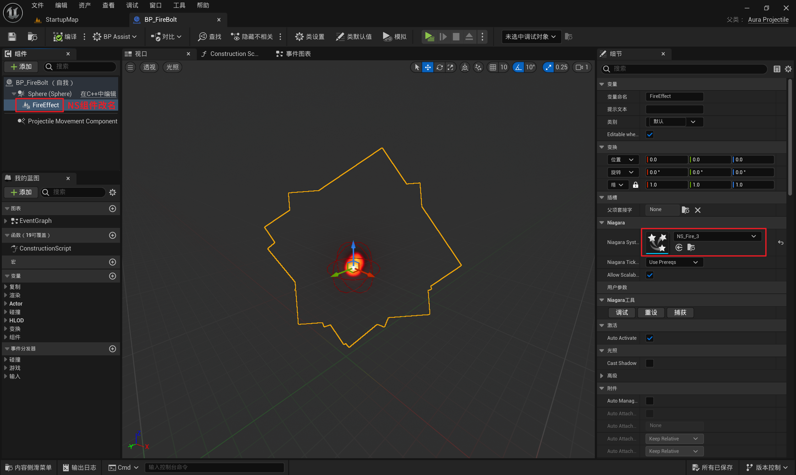
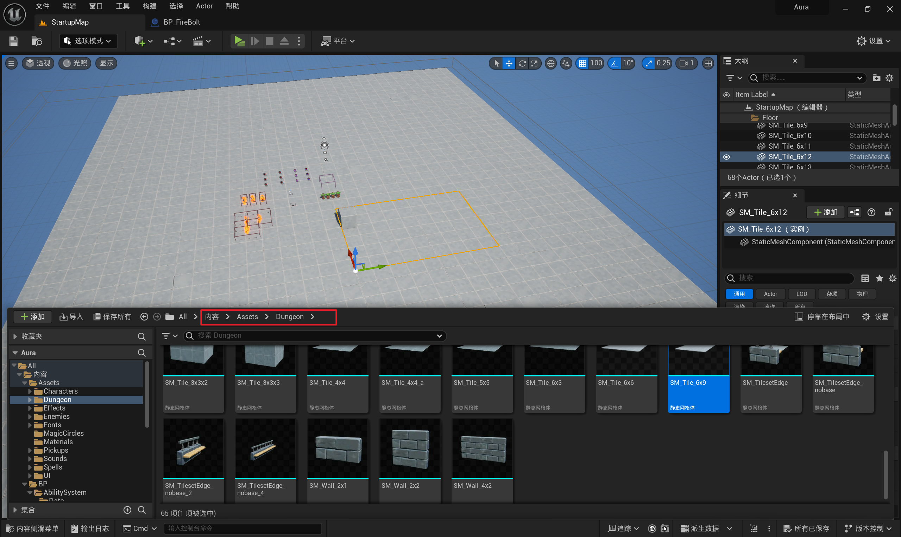

# GAS 5.5 创建抛射物类,蓝图继承并配置NS,替换地板
- **处理关键点:**
    - **C++构造中设置碰撞通道和类型**
    - **C++构造中设置抛射物组件参数**
- 视频链接
    - 【【AI中字】虚幻5C++教程使用GAS制作RPG游戏（一）-哔哩哔哩】 [https://b23.tv/NcHDkEW]("https://b23.tv/NcHDkEW")
- 创建抛射物类，添加 **球形检测** ， **构造** 中设置 **碰撞检测通道** ；添加 **抛射物组件** ， **构造中** 设置： **速度/最大速度/受重力影响度** （这是一个归一化值，0为不受影响）
    -  
    - 头文件
        -  
    - 源文件
        -  
- 创建蓝图派生类，添加并配置NS
    -  
    -  
- 替换地板
    -  