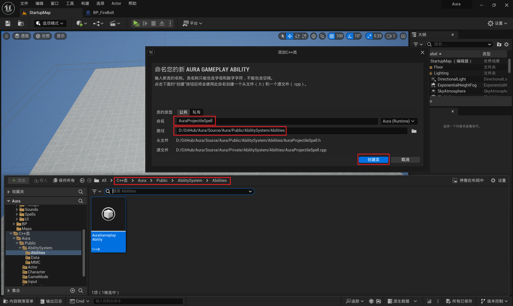
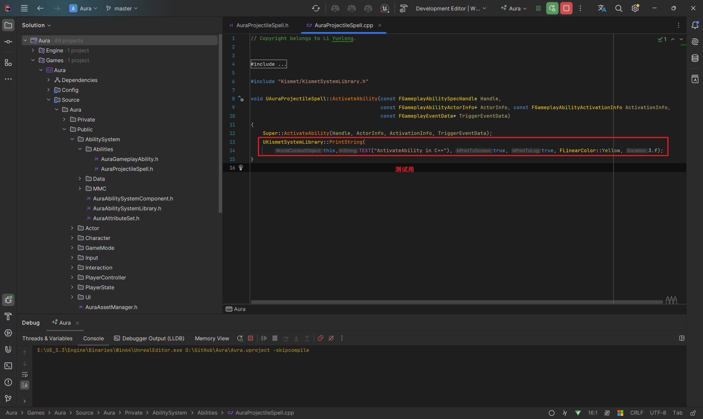
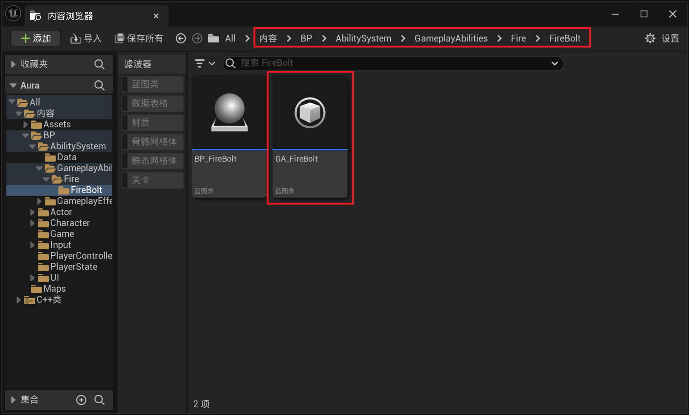
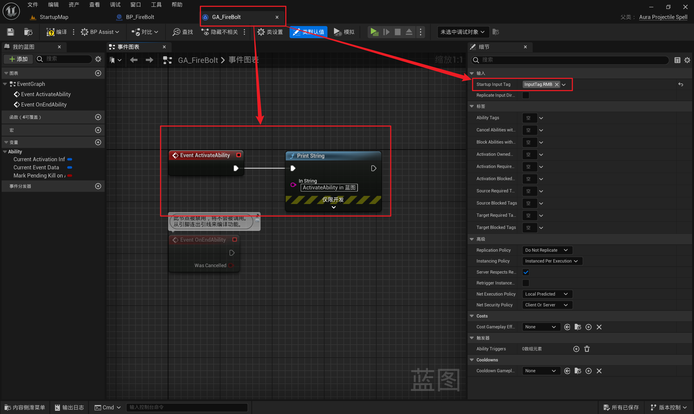
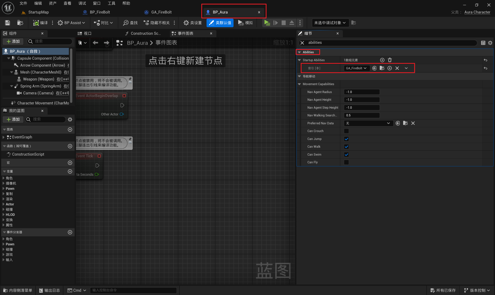
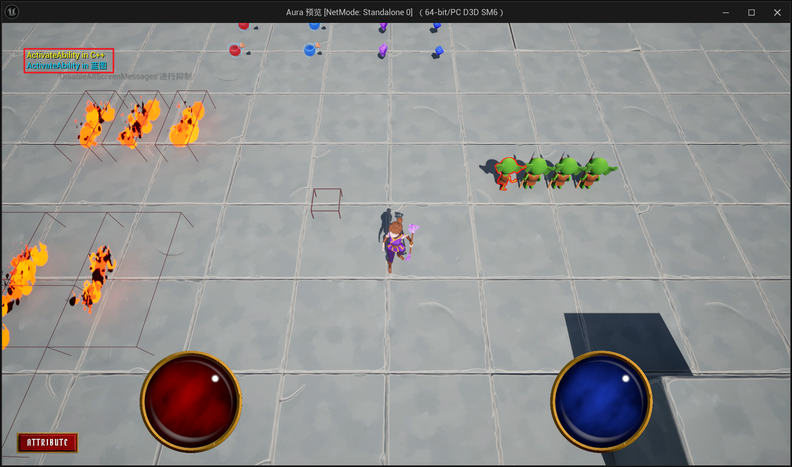

# GAS 5.6 创建新的C++类继承自UAuraGameplayAbility重写ActivateAbility虚函数打印测试
- 视频链接
    - 【【AI中字】虚幻5C++教程使用GAS制作RPG游戏（一）-哔哩哔哩】 [https://b23.tv/XvDjaI1]("https://b23.tv/XvDjaI1")
- 创建新的C++类继承自 UAuraGameplayAbility
    -  
- UAuraProjectileSpell 中，重写基类中 **ActivateAbility** 这个虚函数
    - 头文件
        -  
    - 源文件
        -  
- 创建UAuraProjectileSpell的蓝图派生类 ***GA_FireBolt***
    -  
    -  
- 在角色 ***BP_Aura*** 中配置，才能生效
    -  
- 此时测试结果， **蓝图先打印，C++后打印** 