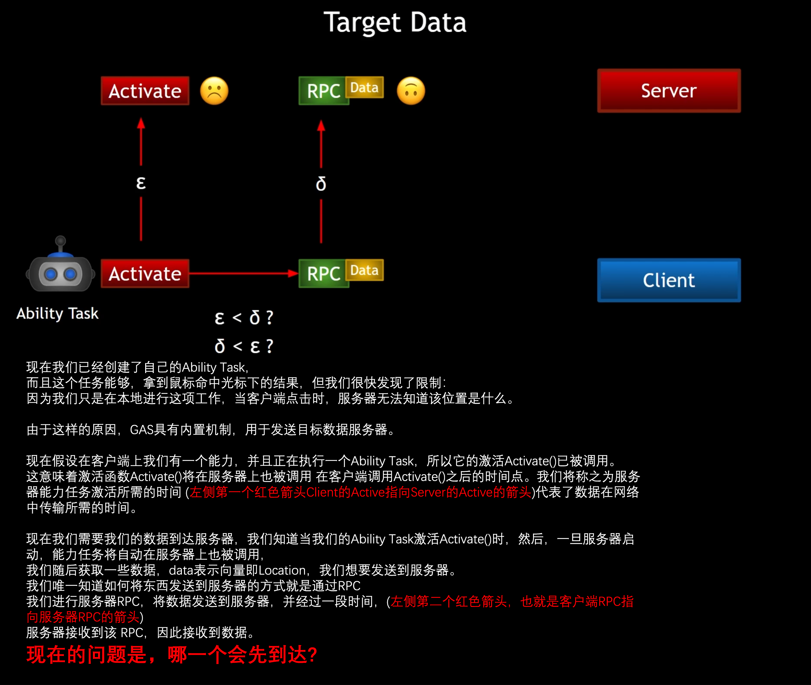
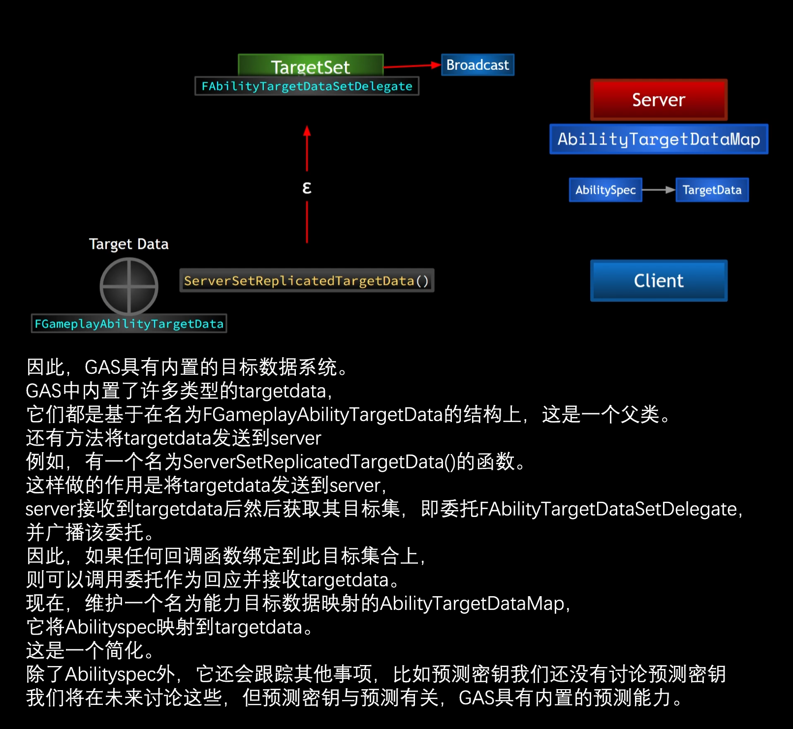
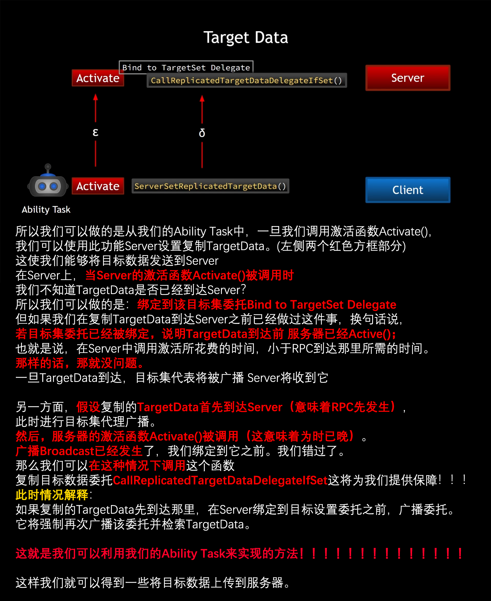

# GAS 5.9 Ability Task中的TargetData处理时间差异的方法流程思路
- **1.梳理清楚GAS的AbilityTask中TargetData的网络同步，时间差异思路梳理：**
    - **有两个通信事件：1是ClientActive到ServerActive；1完成后Server绑定委托到目标集；2是Client的TargetData到Server的TargetData**
    - **若时间顺序为12则没有问题，此时只需要在执行2时检查是否绑定到目标集若绑定说明顺序为12，否则顺序为21**
- GA TargetData同步情况分析
    - 正常情况下，两个红色箭头不一定哪个先到达 
    -  
        - 在Gameplay Ability System (GAS) 中，目标数据系统是一个非常重要的组成部分，它允许你在使用技能时指定目标并将这些目标信息传递到服务器。以下是详细解释：
        - **FGameplayAbilityTargetData 结构** ：
            - 这是一个基础结构（struct），用于存储关于技能目标的信息。GAS 中的许多不同类型的目标数据都基于这个结构。每个目标数据类型都可以包含不同的信息，例如目标位置、目标单位等。
        - **ServerSetReplicatedTargetData() 函数** ：
            - 这是一个函数，用于将目标数据从客户端发送到服务器。客户端在确定了技能的目标后，会调用这个函数，将目标数据传递给服务器。
        - **目标数据的处理** ：
            - 服务器接收到目标数据后，会获取其目标集（target set）。这个过程涉及到一个委托（delegate），即 FAbilityTargetDataSetDelegate ，服务器会广播这个委托。
            - 如果有任何回调函数绑定到了这个目标集合上，那么在服务器广播这个委托时，这些回调函数就会被调用，并接收到目标数据。
        - **AbilityTargetDataMap** ：
            - 这是一个映射（map），用于将 AbilitySpec 映射到目标数据。 AbilitySpec 是描述一个技能实例的具体信息。
            - 除了映射 AbilitySpec 到目标数据外，这个映射还会跟踪其他信息，例如预测密钥（prediction key）。预测密钥用于在客户端和服务器之间同步技能的状态，确保技能的预测和执行一致。
        - 具体流程
            - **客户端确定目标** ：
                - 玩家在客户端上使用某个技能，并选择目标。此时，客户端会创建一个 FGameplayAbilityTargetData 对象，包含目标的信息。
            - **发送目标数据到服务器** ：
                - 客户端调用 ServerSetReplicatedTargetData() 函数，将 FGameplayAbilityTargetData 对象发送到服务器。
            - **服务器处理目标数据** ：
                - 服务器接收到目标数据后，调用与 FAbilityTargetDataSetDelegate 关联的回调函数。这些回调函数会处理目标数据，例如应用技能效果。
            - **维护目标数据映射** ：
                - 在服务器端， AbilityTargetDataMap 用于跟踪 AbilitySpec 和对应的目标数据。这确保了技能的执行能够正确地应用到指定的目标上。
            - 这种机制确保了技能的目标信息能够在客户端和服务器之间准确传递和处理，提供了一个灵活且强大的系统来管理技能的目标选择和应用。
- Ability Task中的TargetData网络属性同步流程
    - **红色部分** 为梳理 
        - 围绕着如何在Gameplay Ability System (GAS) 中可靠地处理目标数据（TargetData）传输和回调。以下是更详细的解释和流程：
            - **客户端激活技能并发送目标数据** ：
                - 在 Ability Task 中，当我们调用 Activate() 函数时，我们会使用 ServerSetReplicatedTargetData() 来将目标数据发送到服务器。
            - **目标数据到达服务器的时间不确定性** ：
                - 当服务器端的 Activate() 函数被调用时，服务器可能还没有收到客户端发送的目标数据。这是因为RPC（远程过程调用）需要时间，数据传输可能会有延迟。
            - 处理时间差异的方法
                - 为了处理目标数据到达时间的不确定性，我们可以采取以下措施：
                - 1. **绑定目标集委托** ：
                - 服务器在 Activate() 函数中，可以先绑定目标集委托（Target Set Delegate）。这个委托会在服务器接收到目标数据时被广播。
                - 2. **两种情况的处理** ：
                    - **情况一：目标数据在服务器调用Activate()之前到达**
                    - 这种情况下，当目标数据到达服务器时，会广播目标集委托。此时，服务器已经绑定了该委托，因此回调函数会被正确调用，目标数据可以被处理。
                    - **情况二：服务器调用Activate()在目标数据到达之前**
                    - 在这种情况下，服务器已经绑定了目标集委托，但目标数据尚未到达。等到目标数据到达后，目标集委托会被广播，回调函数会被正确调用。
                    - 3. **保障措施：CallReplicatedTargetDataDelegateIfSet**
                    - 为了确保在所有情况下都能正确处理目标数据，我们可以使用 CallReplicatedTargetDataDelegateIfSet() 函数。这个函数的作用是在目标数据到达后，如果已经有绑定的委托，则强制再次广播该委托。
                - 这意味着，即使目标数据在 Activate() 之后到达，只要调用这个函数，服务器仍然可以确保回调函数被正确调用，并处理目标数据。
        - 具体实现步骤
            - **1.在Activate()中绑定目标集委托** ：
                - `**void UMyAbilityTask::Activate(){    // 绑定目标集委托    AbilitySystemComponent->AbilityTargetDataSetDelegate.AddUObject(this, &UMyAbilityTask::OnTargetDataReceived);    // 发送目标数据到服务器    ServerSetReplicatedTargetData(TargetData);}**`
            - **2.实现目标数据接收的回调函数** ：
                - `**void UMyAbilityTask::OnTargetDataReceived(const FGameplayAbilityTargetDataHandle& Data){    // 处理目标数据}**`
            - **3. 在Activate()之后调用CallReplicatedTargetDataDelegateIfSet()** ：
                - `**void UMyAbilityTask::Activate(){    // 绑定目标集委托    AbilitySystemComponent->AbilityTargetDataSetDelegate.AddUObject(this, &UMyAbilityTask::OnTargetDataReceived);    // 发送目标数据到服务器    ServerSetReplicatedTargetData(TargetData);    // 调用保障函数    AbilitySystemComponent->CallReplicatedTargetDataDelegateIfSet();}**`