# GAS 6.2 修正火球角度，添加复制，按下shift时普攻
- **处理关键点：**
    - **1.使用：** `**向量.Rotation();**` **获取角度FRotator**
    - **2.使用：** `**角度.Quaternion();**` **获取该角度的四元数**
    - **3.C++中设置 碰撞通道**
    - **4.** **DS** **/** **LS网络复制相关**
- 视频链接
    - 【【AI中字】虚幻5C++教程使用GAS制作RPG游戏（一）-哔哩哔哩】 [https://b23.tv/IGADhLV]("https://b23.tv/IGADhLV")
- 生成抛射物的函数 **SpawnProjectile** 中，
    - 头文件，添加形参，传入位置
        -  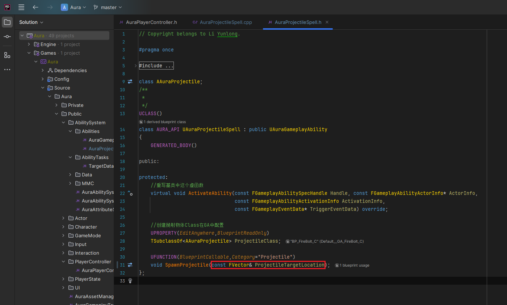
    - 源文件，计算方向，设置Rotation
        -  
- GA蓝图 ***GA_FireBolt*** 中，获取HitResult后保存 **Location** ，传参
    -  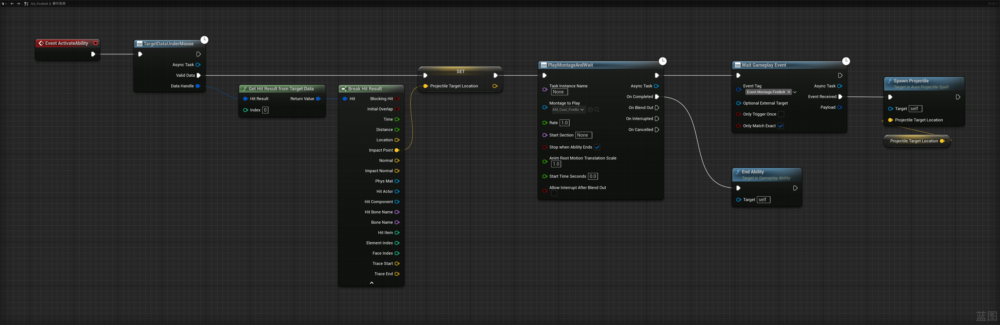
- 此时有个问题，一个角色会把另一个角色弹簧臂挡住，需要C++中设置一下角色capsule和mesh的碰撞通道，对camera为忽略
    -   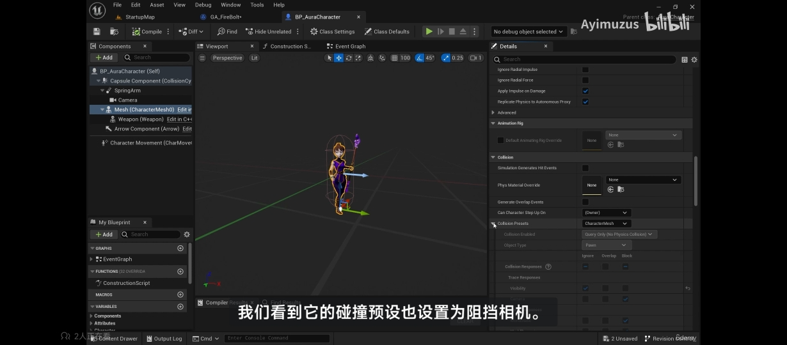
    -  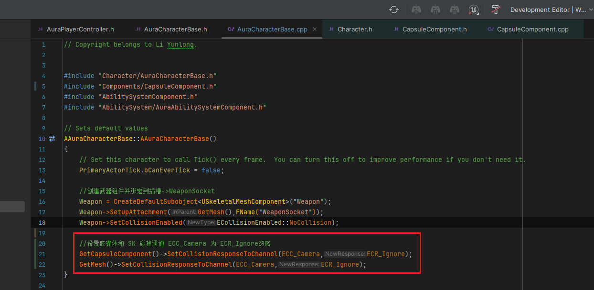
    -   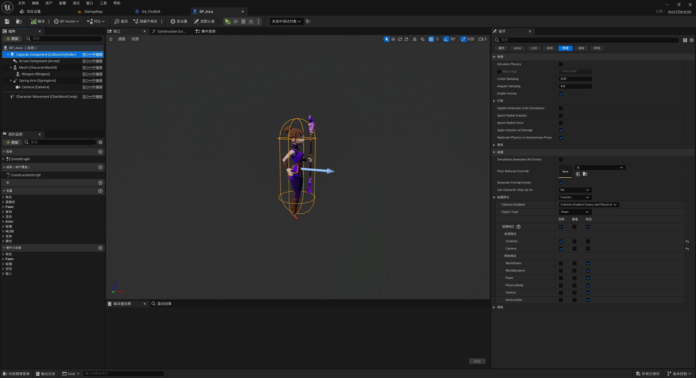
- 此时希望添加一个功能，按下shift时，不用点到敌人，也可以发射普通攻击火球
    - **步骤**
        - 1.添加InputAction,并设置为1d输入
            -  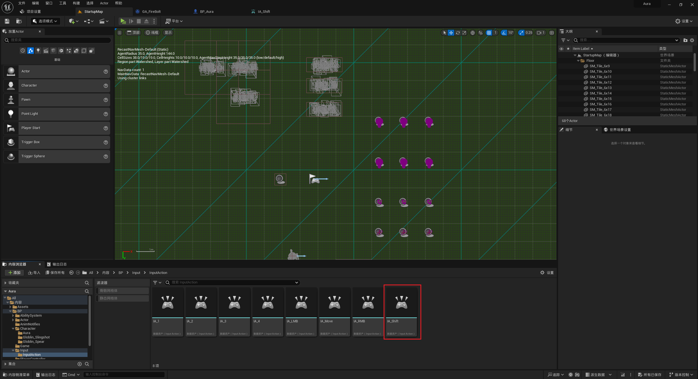
            -  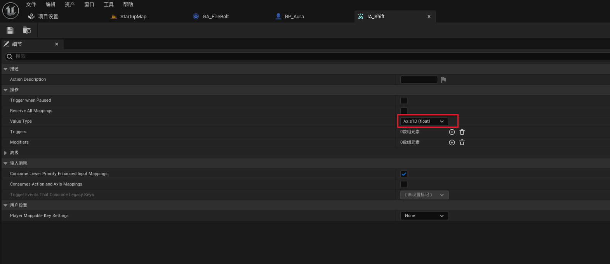
        - 2.配置InputAction
            -  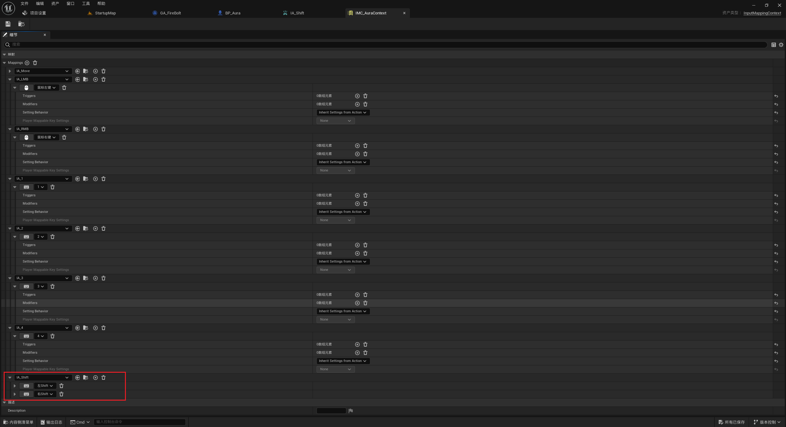
        - 3. AAuraPlayerController 中
            -  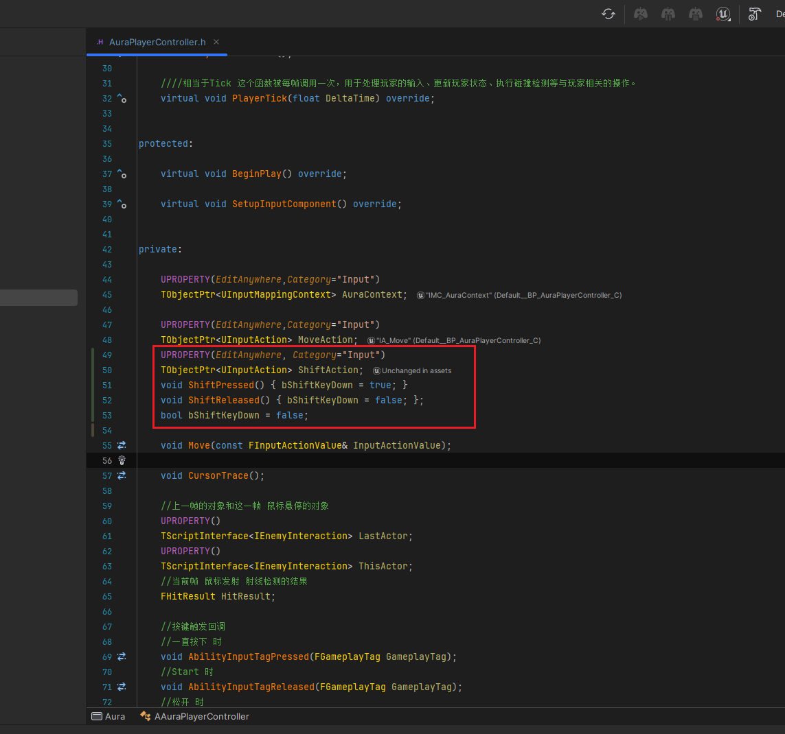
            -  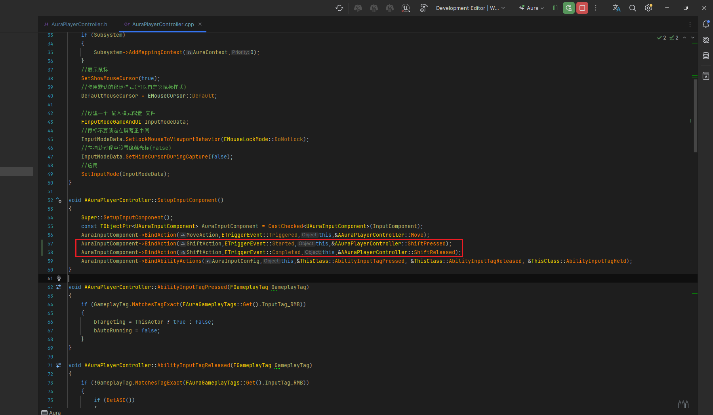
            -  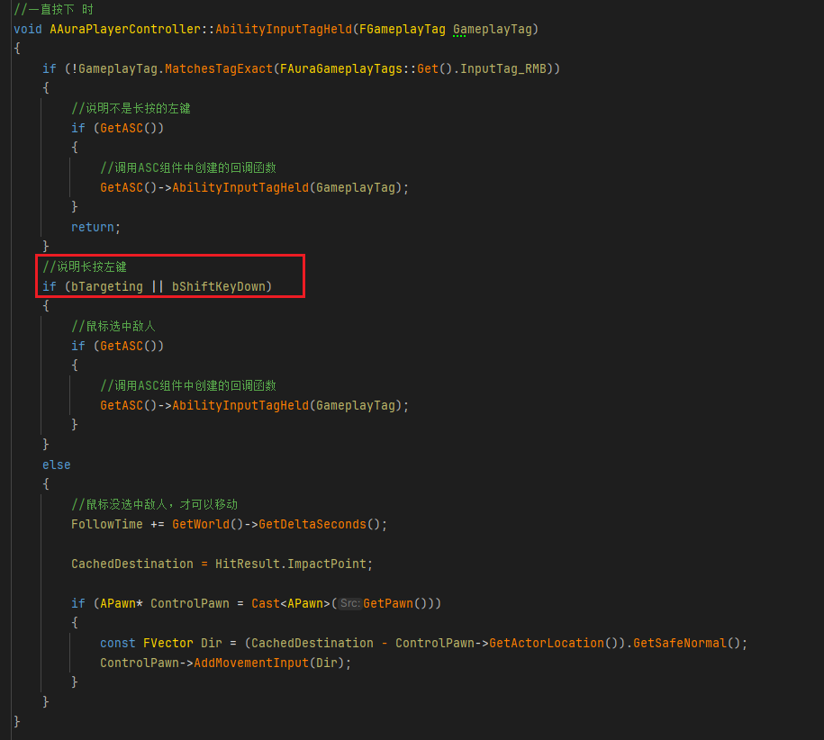 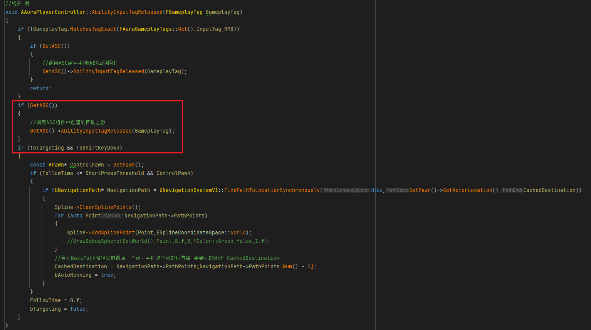
        - ***BP_AuraPlayerController*** 中配置
            -  
- 记得火球 AAuraProjectile 中开启复制bReplicates，否则客户端无法看见
    -  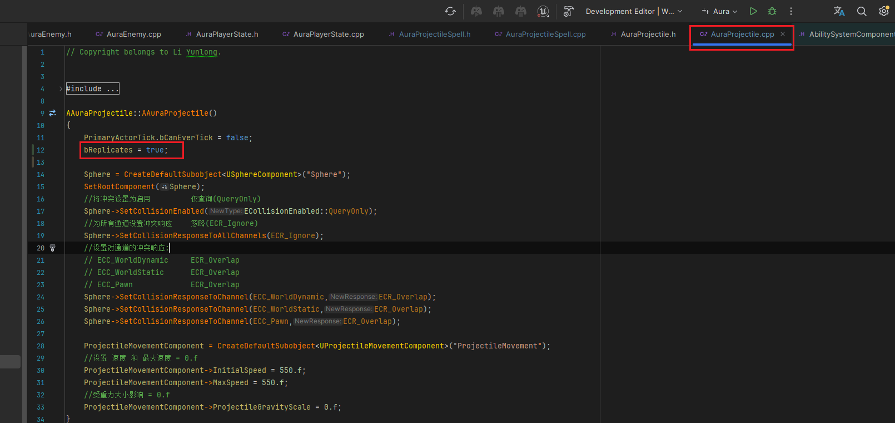
- 此时效果gif 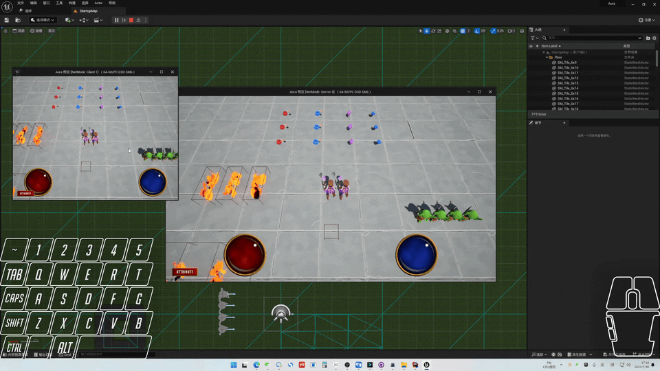