# GAS 6.4 当火球发生撞击时产生音效和Niagara粒子，火球飞行时加loop音效绑定到root,持有该音频组件，撞击后停止音效
- **处理关键点：**
    - **1.生成音频调用API：** **UGameplayStatics::PlaySoundAtLocation** ； **生成音频绑定在目标身上API：** **UGameplayStatics::SpawnSoundAttached** **此函数返回一个组件，可以使用** `**.Stop();**` **停止播放**
    - **2.使用Niagara粒子系统需要引模块"**
    - **3.生成Niagara粒子调用API：** **UNiagaraFunctionLibrary::SpawnSystemAtLocation** ；
    - **4.重写Destoryed虚函数时，注意!!!要在调用父函数之前写逻辑!!!!!!!!!!!!!!!!!!!!!!!!!!!!!!!!!!!!!!!!!!!!!!!!!!!!!!!!!!!!!!!!!!!!!!!!!!!!!!**
- 视频链接
    - 【【AI中字】虚幻5C++教程使用GAS制作RPG游戏（一）-哔哩哔哩】 [https://b23.tv/met5M9E]("https://b23.tv/met5M9E")
- 使用Niagara粒子系统需要引模块" **Niagara** "
    -  
- AAuraProjectile 中，创建Niagara粒子组件和音频组件。
    -  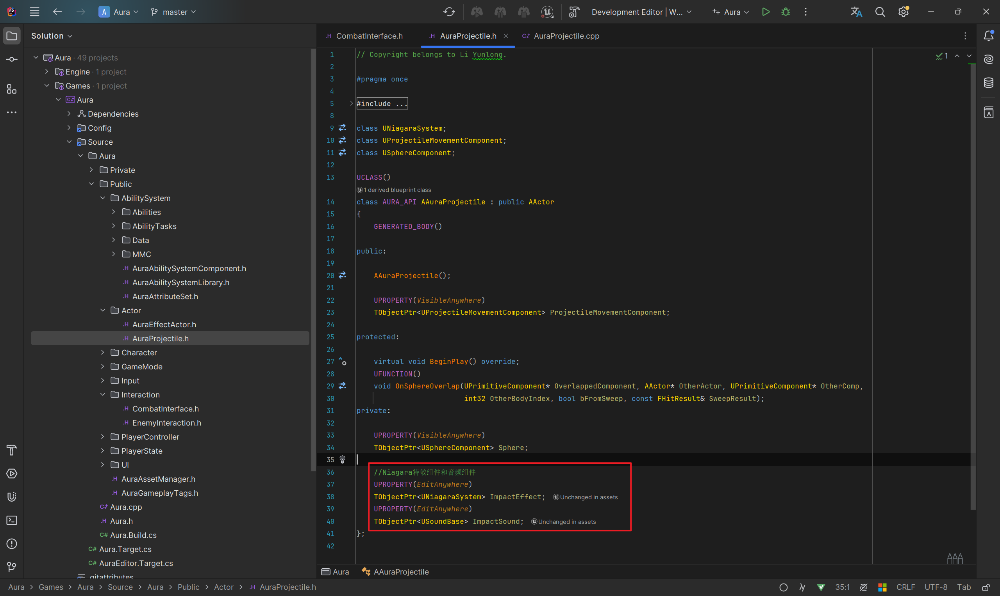
- 在抛射物组件中，当overlap重叠发生时 **UGameplayStatics::PlaySoundAtLocation** ； **UNiagaraFunctionLibrary::SpawnSystemAtLocation** ；然后判定是否为权威端，如果是权威端的话 **destroy**
    -  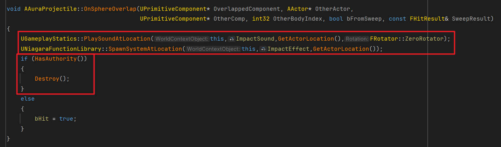
        -  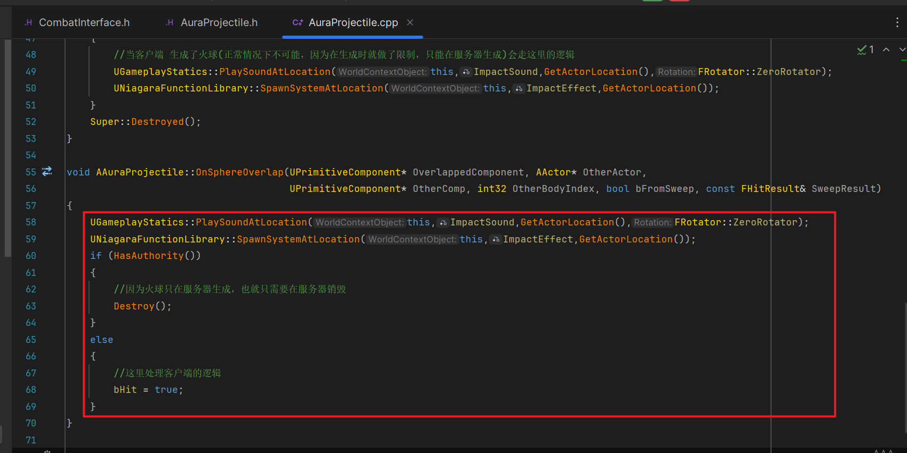
- AAuraProjectile 中重写 **Destroyed** 虚函数。
    -  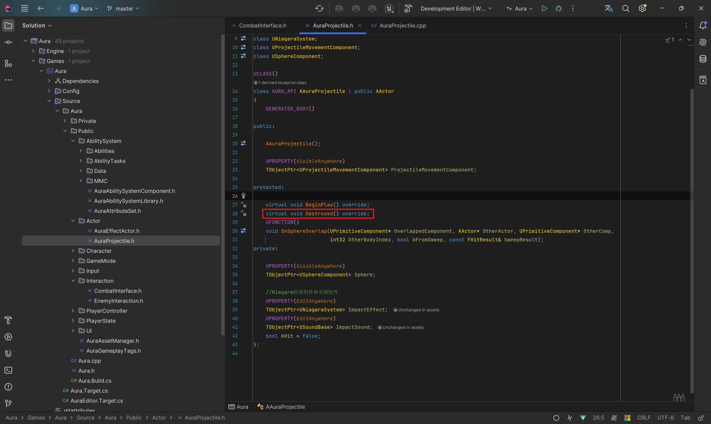
    -  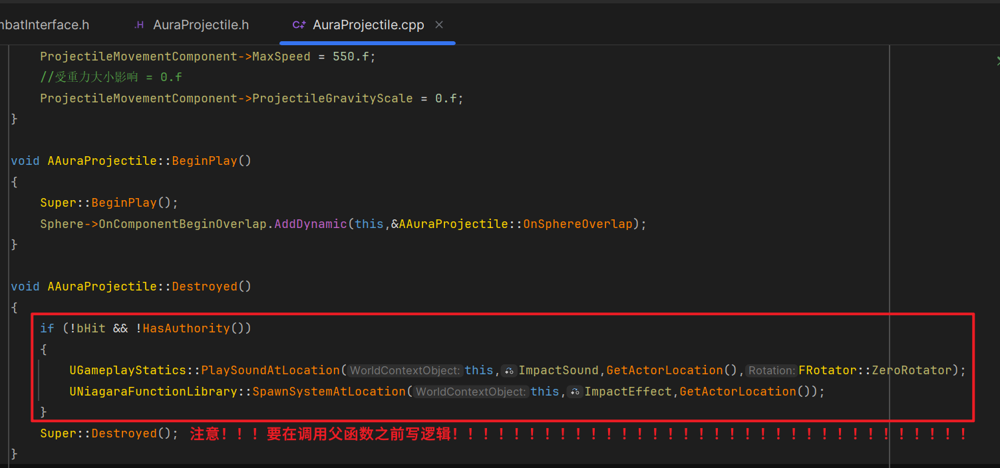
        -  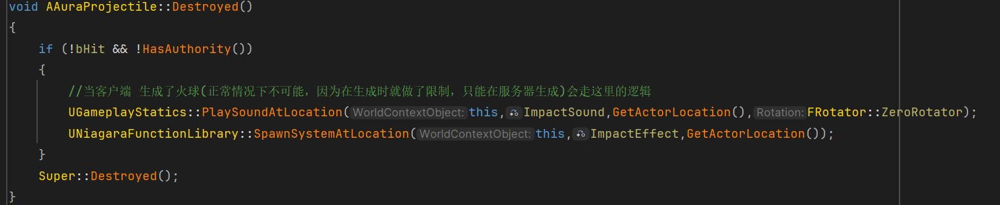
    - **3.重写Destoryed虚函数时，注意!!!要在调用父函数之前写逻辑!!!!!!!!!!!!!!!!!!!!!!!!!!!!!!!!!!!!!!!!!!!!!!!!!!!!!!!!!!!!!!!!!!!!!!!!!!!!!!**
- 在蓝图中，配置Niagara粒子系统和音频组件。
    -  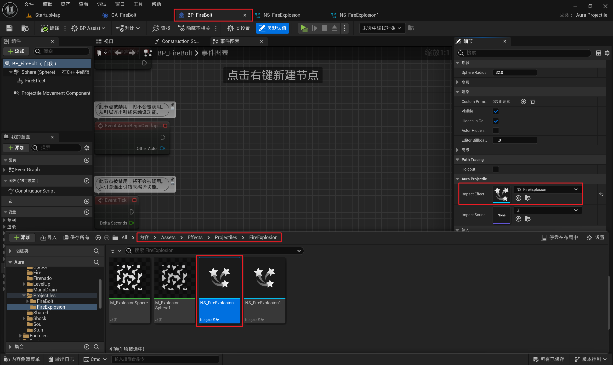 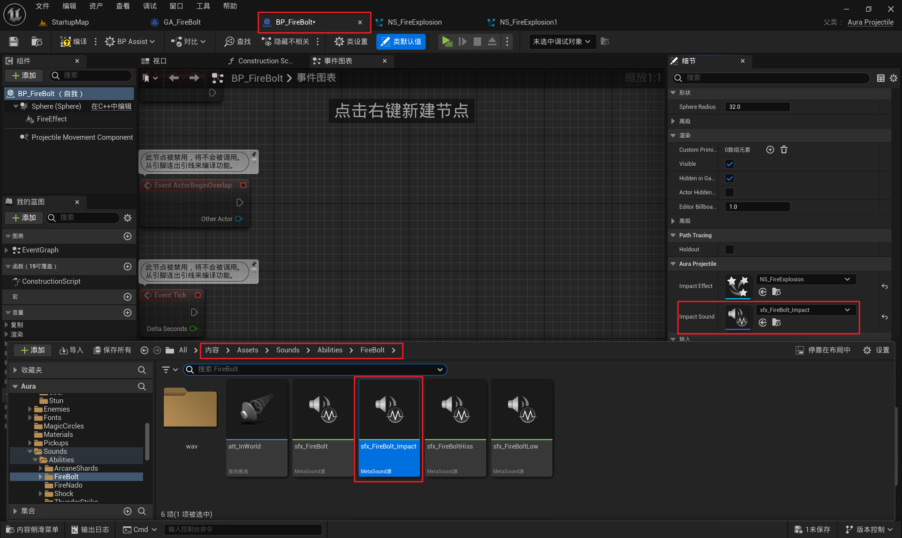
- 在火球发射时使用动画通知，播放音效，添加动画通知通道
    -  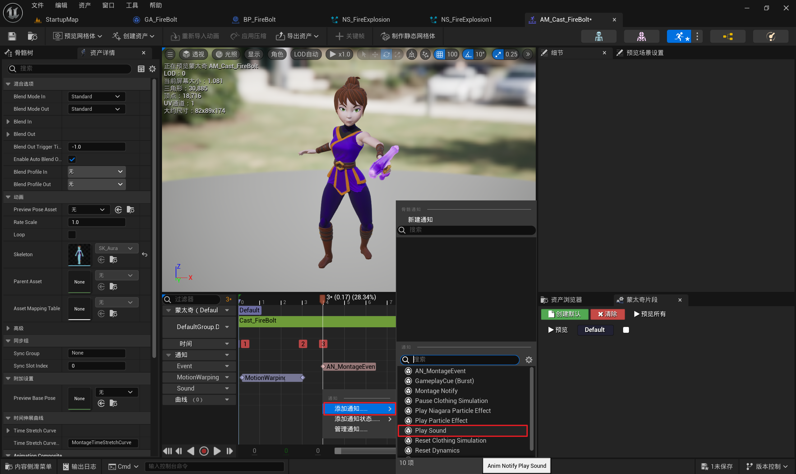
    -  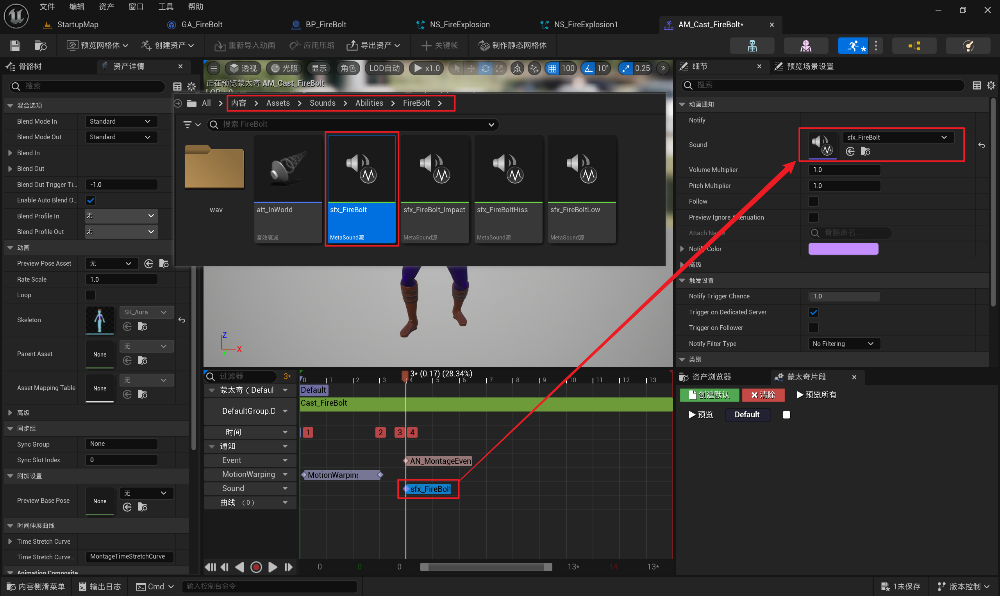
- 小测试 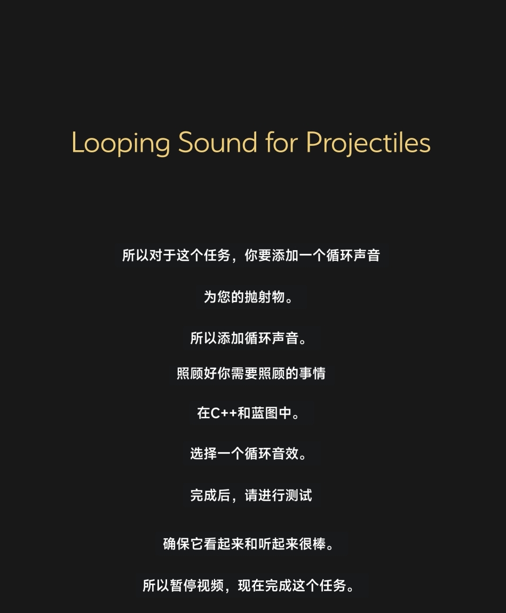
    - 在抛射物 AAuraProjectile 中再添加一个循环声音组件。 **Beginplay** 时把它绑定在跟骨骼上。
        -  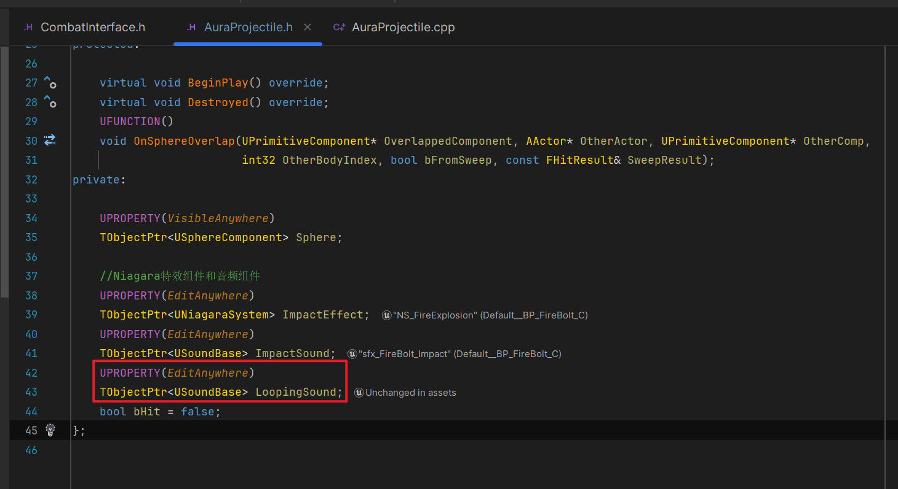
        -  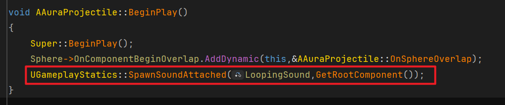
    - 因为想删除的话，需要拿到这个函数的返回值是一个 audio component组件。
        -  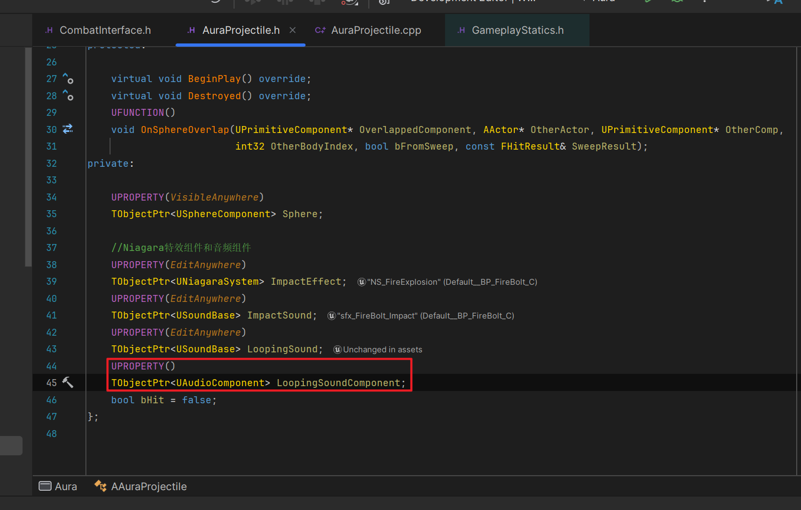
        -  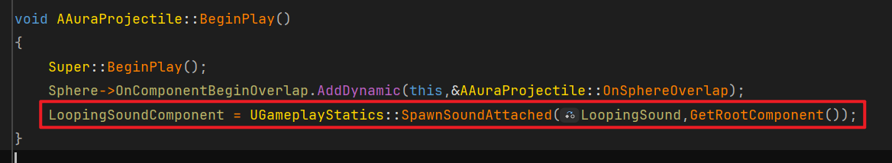
    - 当重叠发生时 Overlap的回调函数中需要停止这个循环声音组件
        -  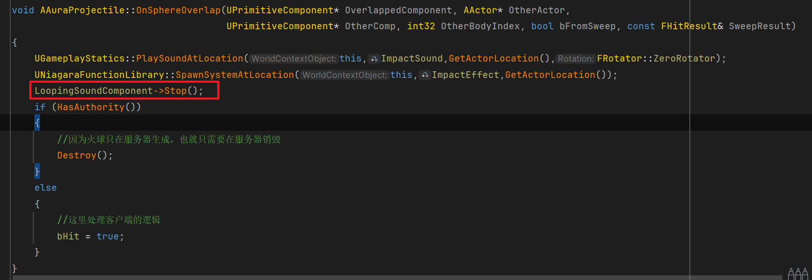
            - **如果无法调用，需要引头文件** 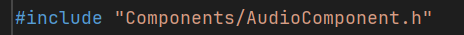
        -  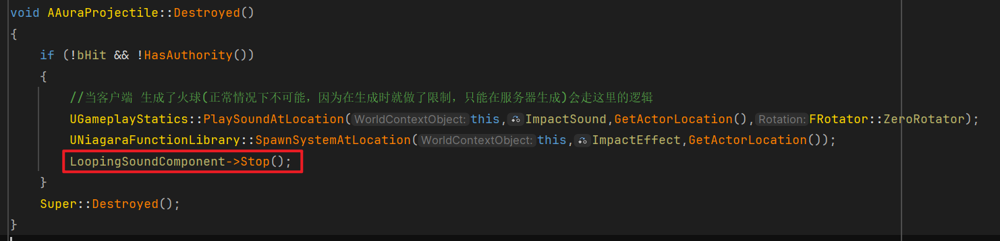
    - 蓝图中配置
        -  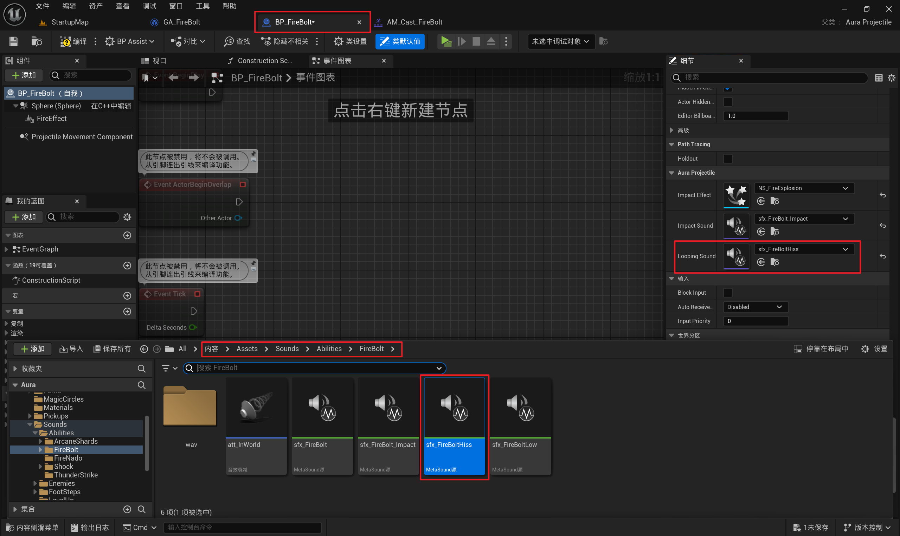
    - AAuraProjectile 中，为火球设置生命周期，防止无限存活占用内存，并在 **Beginplay** 时设置
        - 头文件
            -  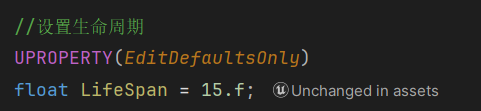
        - 源文件
            -  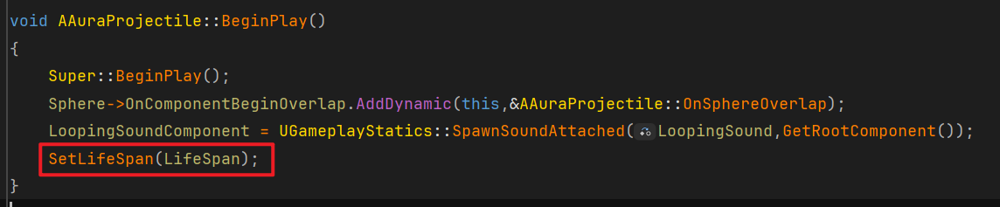
- 此时，哥布林太矮了打不到，可以等出手位置低的时候攻击。。。 
    -  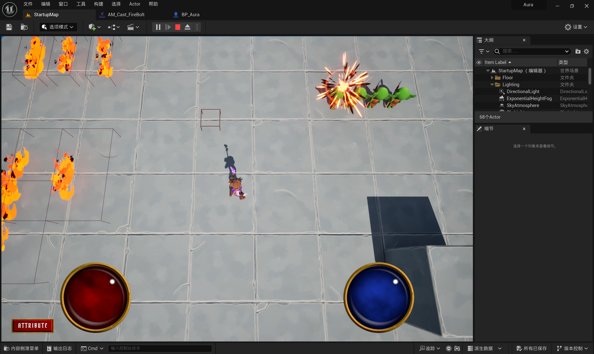